---
html:
    embed_local_images: true
    toc: true
toc:
    depth_from: 1
    depth_to: 2
    ordered: false
export_on_save:
    html: true
---

<!-- Importing styles for numbering sections from H1 -->
<!-- @import "C:/Users/aviat/.atom/mpe-styles/numbering-from-h1.less" -->
<!-- Importing fancy github-light theme -->
<!-- @import "C:/Users/aviat/.atom/mpe-styles/fancy-github-light.less" -->


# Week 10 - Lec.27 & Lec.28 {ignore=True .ignorenumbering}


## TOC {ignore=True .ignorenumbering}

<!-- @import "[TOC]" {cmd="toc" depthFrom=1 depthTo=2 orderedList=false} -->
<!-- code_chunk_output -->

* [Lec.27 - Introduction to Graph](#lec27-introduction-to-graph)
	* [Introduction](#introduction)
	* [Graph Representation](#graph-representation)
* [Lec.28 - Graph Traversal](#lec28-graph-traversal)
	* [Depth First Traversal](#depth-first-traversal)
	* [Breadth First Search](#breadth-first-search)
	* [Efficiency of Graph Problems](#efficiency-of-graph-problems)

<!-- /code_chunk_output -->


# Lec.27 - Introduction to Graph


## Introduction

***Graph***: A set of nodes (a.k.a. vertices) connected pairwise by edges:
- Set of ***vertices***, a.k.a. ***nodes***
- Set of ***edges***: Pairs of vertices
- Vertices with an edge between are ***adjacent***
- Optional: Vertices or edges may have ***weights*** (or ***weights***)

***Path***: A sequence of vertices connected by edges

***Cycle***: A path whose first and last vertices are the same:
- A graph with a cycle is called *cyclic*

Two vertices are ***connected*** if there is a path between them:
- If all vertices are connected, the graph is called connected

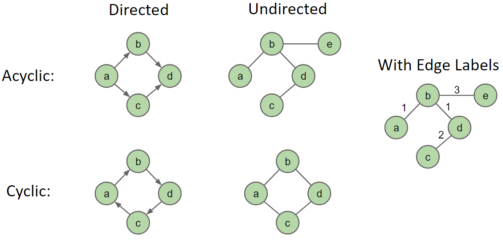

### Problems

- **s-t Path**: Is there a path between vertices s and t ?
- **Shortest s-t Path**: What is the shortest path between vertices s and t ?
- **Cycle**: Does the graph contain any cycles ?
- **Euler Tour**: Is there a cycle that uses every edge exactly once ?
- **Hamilton Tour**: Is there a cycle that uses every vertex exactly once ?
- **Connectivity**: Is the graph connected, i.e.: is there a path between all vertex pairs ?
- **Biconnectivity**: Is there a vertex whose removal disconnects the graph ?
- **Planarity**: Can we draw the graph on a piece of paper with no crossing edges ?
- **Isomorphism**: Are two graphs isomorphic (the same graph in disguise) ?

### Examples

#### Facebook: Connectivity between cities {ignore=True .ignorenumbering}

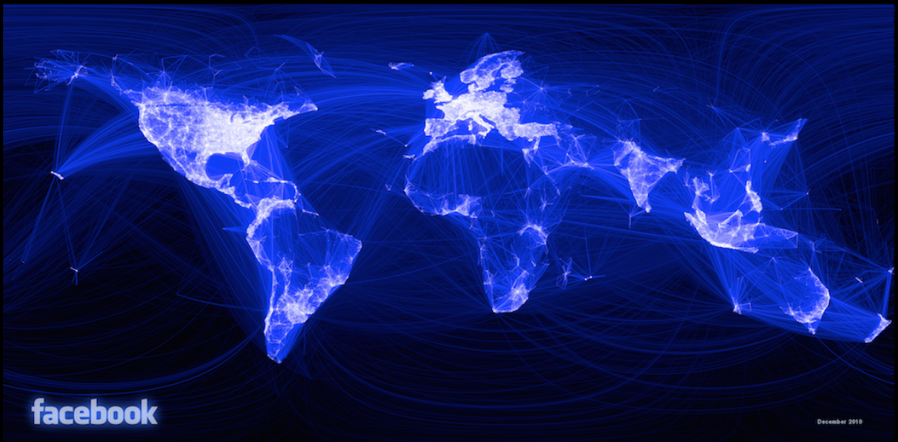

#### Scientific journals' click through rates {ignore=True .ignorenumbering}


## Graph Representation

### Graph API

{++Common convention++}: Number nodes irrespective of label
- Use `Map<Label, Integer>` to lookup a vertex by label

> Graph API

```java
public class Graph {
    
    /** Creates empty graph with `V` vertices */
    public Graph(int V);
    
    /** Adds an edge `v`-`w` */
    public void addEdge(int v, int w);
    
    /** Vertices adjacent to `v` */
    Iterable<Integer> adj(int v);
    
    /** Returns the number of vertices */
    int V();
    
    /** Returns the number of edges */
    int E();
}
```

> Example client

```java
/** Returns the degree of vertex `v` in graph `G` */
public static int degree(Graph G, int v) {
    int degree = 0;
    for (int w : G.adf()) {
        degree += 1;
    }
    return degree;
}
```

### Graph Representations

#### Representation 1: Adjacency Matrix

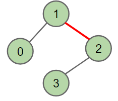

| v\w | 0 | 1                  | 2                  | 3 |
|-----|---|--------------------|--------------------|---|
| 0   | 0 | 1                  | 0                  | 0 |
| 1   | 1 | 0                  | {==1==}{>>space<<} | 0 |
| 2   | 0 | {==1==}{>>space<<} | 0                  | 1 |
| 3   | 0 | 0                  | 1                  | 0 |

- For undirected graph, each edge is represented twice: Simplicity at the expense of space

<br>

#### Representation 2: Edge Set

Collection of all edges: 
- e.g.: `HashSet<Edge>` where each `Edge` is a pair of ints
- `{(0, 1), (0, 2), (1, 2)}`

#### Representation 3: Adjacency List

Common approach: Maintain array of lists indexed by vertex number:
- Most popular approach for representing graphs

| Graph                                                            | Representation                                                    |   |
|------------------------------------------------------------------|-------------------------------------------------------------------|---|
| {>>img<<}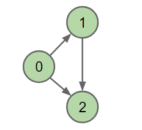 | {>>img<<}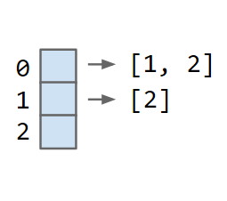 |   |

### Runtimes


> Printing an entire graph
```java
for (int v = 0; v < G.V(); v += 1) {
    for (int w : G.adj(v)) {
        System.out.println(v + "-" + w);
    }
}
```
- $V$: The number of Vertices
- $E$: The number of edges

#### Runtime of Printing An Entire Graph

- **Adjacency MATRIX**: $\Theta(V^2)$
- **Adjacency LIST**:
    * Use only $V$:
        + Base case: $\Theta(V)$
        + Worst case: $\Theta(V^2)$
        + Runtime of `for (int w)`: $\Omega(1), O(V)$
        + Runtime of `for (int v)`: $V$
    * Use both $V, E$:
        + All cases: $\Theta(V + E)$

How to interpret $\Theta(V + E)$:
- No matter what *shape* of increasingly complex graphs we generate, as $V$ and $E$ grow, the runtime will always grow exactly as $\Theta(V + E)$
- E.g.1: Very sparse graph where $E$ grows very slowly, e.g.: every vertex is connected to its square: 2-4, 3-9, 4-16...:
    * $E$ is $\Theta({\sqrt V})$. Runtime is $\Theta(V + {\sqrt V}) = \Theta(V)$
- E.g.2: Very dense graph where $E$ grows very quickly, e.g.: every vertex connected to every other:
    * $E$ is $\Theta(V^2)$. Runtime is $\Theta(V + V^2) = \Theta(V^2)$

#### Runtime of Basic Graph Operations

| Representation   | `addEdge(s, t)` | `for(w : adf(v))`          | `printGraph()`  | `hasEdge(s, t)`           | Space used      |
|------------------|-----------------|----------------------------|-----------------|---------------------------|-----------------|
| Adjacency matrix | $\Theta(1)$     | $\Theta(V)$                | $\Theta(V^2)$   | $\Theta(1)$               | $\Theta(V^2)$   |
| Edge Set         | $\Theta(1)$     | $\Theta(E)$                | $\Theta(E)$     | $\Theta(E)$               | $\Theta(E)$     |
| Adjacency list   | $\Theta(1)$     | $\Theta(1)$ to $\Theta(V)$ | $\Theta(V + E)$ | $\Theta({\rm degree}(v))$ | $\Theta(V + E)$ |
(Note: `printGraph()` and `hasEdge(s, t)` are not part of the `Graph` class's API)

In practice, adjacency list is most common:
- Many graph algorithms rely heavily on `adj(v)`
- Most graphs are sparse (not many edges in each bucket)


# Lec.28 - Graph Traversal

## Depth First Traversal

### s-t Path Problem {ignore=True .ignorenumbering}

Suppose we want to know if there exists a path from vertex `s` = 0 to vertex `t` = 7:
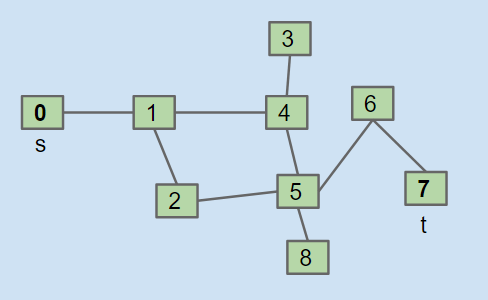

##### Wrong idea

1. Check `s == t`, if so, return true
2. Check all of `s`'s neighbors for connectivity to `t`

=> Fail into infinite loop...

##### Improved idea: [demo](https://docs.google.com/presentation/d/1IJyC4cAogU2x3erW7E3hDz8jWDTLoaaot8u2ebHtpto/pub?start=false&loop=false&delayms=3000&slide=id.g76e0dad85_2_380)

1. *Mark* `s`
2. Check `s == t`, if so, return true
3. Check all of `s`'s *unmarked* neighbors for connectivity to `t

=> This idea of exploring the entire subgraph for each neighbor is known as ***Depth First Search*** traversal.

### Implementation

Common design pattern in graph algorithms: *Decouple type from processing algorithm*:
- Create a `Graph` object
- Pass the graph to a graph-processing method (or constructor) in a client class
- Query the client class for information

> Recursive Implementation: [demo](https://docs.google.com/presentation/d/1lTo8LZUGi3XQ1VlOmBUF9KkJTW_JWsw_DOPq8VBiI3A/edit#slide=id.g76e0dad85_2_380)

```java
public class DepthFirstPaths {
    
    private boolean[] marked; // Tracks marked vertices
    private int[] edgeTo; // Tracks from which vertex the path came to an edge
    private int s;

    /** Finds all paths from `G`'s vertex `s` */
    public DepthFirstPaths(Graph G, int s) {
        ...  // Data structure initialization
        dfs(G, s);
    }

    private void dfs(Graph G, int v) {
        marked[v] = true;
        for (int w : G.adj(v)) {
            if (!markded[w]) {
                edgeTo[w] = v;
                dfs(G, w);
            }
        }
    }

    /** Checks there is a path from `s` to `t` */
    public boolean hasPathTo(int t) {
        return marked[t];
    }

    /** Returns path from `s` to `v` (if any) */
    public Iterable<Integer> pathTo(int t) {
        ...
    }

}
```

### Preorder & Postorder Traversal

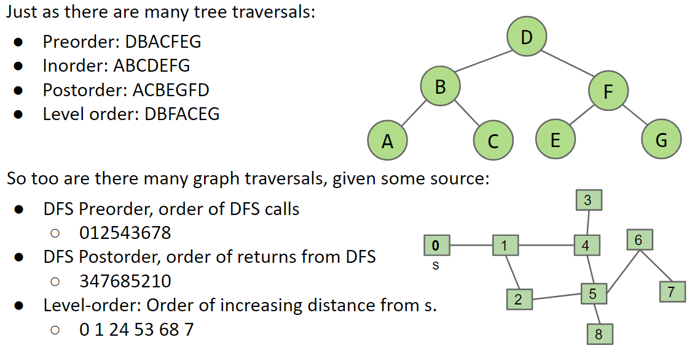

### Topological Sort

#### Topological Sort Problem {ignore=True .ignorenumbering}

Suppose we have tasks `0` through `7`, where an arrow from `v` to `w` indicates that `v` must happen before `w`:
- Valid ordering examples: `[0, 2, 1, 3, 5, 4, 7, 6]`, `[2, 0, 3, 5, 1, 4, 6, 7]`

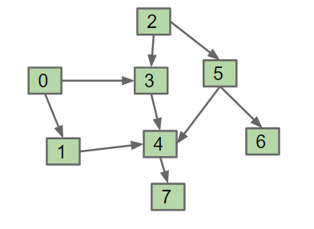

##### Solution {ignore=True .ignorenumbering}

***Perform DFS traversals from every vertex (with indegree 0), NOT clearing markings in between traversals***:
- Record DFS post order in a list: `[7, 4, 1, 3, 0, 6, 5, 2]`
- Topological ordering is given by the reverse of that list (reverse postorder): `[2, 5, 6, 0, 3, 1, 4, 7]`

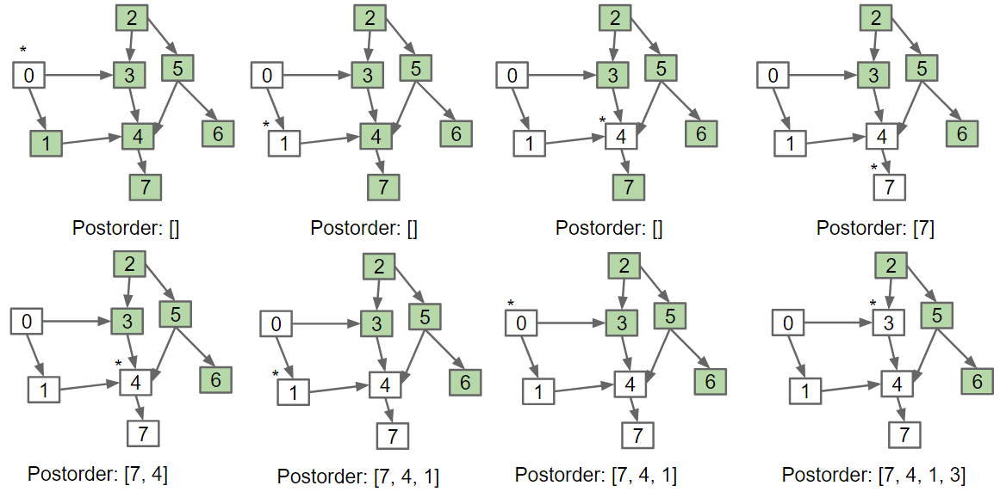
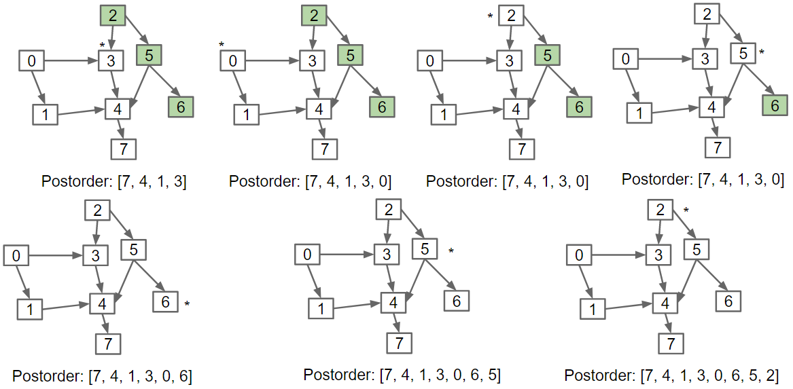

##### Why *Topological Sort*  {ignore=True .ignorenumbering}

Can think of this procedure as sorting our nodes so that they appear in an order consistent with edge:
- When nodes are sorted in diagram, arrows all point rightwards

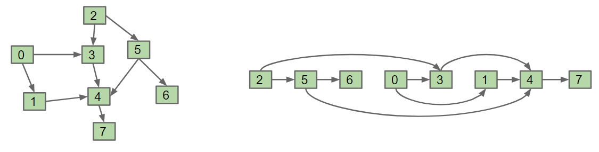

#### Implementation {ignore=True .ignorenumbering}

```java
public class DepthFirstPaths {
    
    private boolean[] marked;
    private Stack<Integer> reversePostorder;  // Use a stack instead of a list
    
    public DepthFirstPaths(Graph G) {
        reversePostorder = new Stack<>();
        marked = new boolean[G.V()];
        
        for (int v = 0; v < G.V(); v += 1) {
            if (!marked[v]) { dfs(G, v); }  // Perform DFS from all unmarked vertices
        }
    }
    
    private void dfs(Graph G, int v) {
        marked[v] = true;
        for (int w : G.adj(v)) {
            if (!marked[w]) { dfs(G, w); }
        }
        reversePostorder.push(v);  // 'Visit' vertex by pushing it in a stack
    }
    
    public Iterable<Integer> reversePostorder() {
        return reversePostorder;
    }
    
}
```

## Breadth First Search

### Shortest Path Problem {ignore=True .ignorenumbering}

Given the graph below, find the shortest path from 0 to every other vertex:


### Solution {ignore=True .ignorenumbering}

Level-order provides the shortest paths from 0 to every reachable vertex from 0 by definition !: *"Level order"* is referred as *"the order visited by **Breadth First Search**"*

##### Breadth First Search [demo](https://docs.google.com/presentation/d/1EGco7EDfVtrqouiUCQr6iY7Lq5mZmvWrprWm5yIQZTQ/pub?start=false&loop=false&delayms=3000&slide=id.g76e0dad85_2_380)

- Initialize a queue with a starting vertex `s` and mark that vertex
    * (A queue here is called **fringe**)
- Repeat until queue is empty:
    * Remove vertex `v` from queue
    * Add to the queue any unmarked vertices adjacent to `v` and mark them

### Implementation {ignore=True .ignorenumbering}

```java
public class BreadthFirstPaths {

    private boolean[] marked;
    private int[] edgeTo;

    ...

    private void bfs(Graph G, int s) {
        Queue<Integer> fringe = new Queue<>();
        fringe.enqueue(s);
        marked[s] = true;

        while(!fringe.isEmpty()) {
            int v = fringe.dequeue();
            for (int w : G.adj(v)) {
                fringe.enqueue(w);
                marked[w] = true;
                edgeTo[w] = v;
            }
        }
    }

}
```

## Efficiency of Graph Problems

| Problem  | Description  | Efficiency  |
|---|---|---|
| s-t paths  | Find a path from `s` to every reachable vertex  | $O(V + E)$ time <br> $\Theta(V)$ space |
| Topological sort  | Find an ordering of vertices consistent with directed edges   | ^  |
| s-t shortest path | Find a shortest path from `s` to every reachable vertex  | ^  |

- Runs in $O(V + E)$ time:
    * Cost model: Each vertex is visited once and each edge is used exactly once. Each visit costs constant time
    * Note.1: we can't say $\Theta(V + E)$, because some `Graph` can have no edges touching source
    * Note.2: If we use adjacency-matrix, runtime will change to $O(V^2)$ (Need to iterate over the entire matrix)
- Space is $\Theta(V)$:
    * A stack or queue need to store $V$ vertices
