---
html:
    embed_local_images: true
    toc: true
toc:
    depth_from: 1
    depth_to: 2
    ordered: false
export_on_save:
    # html: true
---

<!-- Importing styles for numbering sections from H1 -->
<!-- @import "C:/Users/aviat/.atom/mpe-styles/numbering-from-h1.less" -->
<!-- Importing fancy github-light theme -->
<!-- @import "C:/Users/aviat/.atom/mpe-styles/fancy-github-light.less" -->

# Week 12 - Lec.32 & Lec.33 & Lec.34 {ignore=True .ignorenumbering}

## TOC {ignore=True .ignorenumbering}

<!-- @import "[TOC]" {cmd="toc" depthFrom=1 depthTo=2 orderedList=false} -->
<!-- code_chunk_output -->

* [Lec.32 - Basic Sorts](#lec32-basic-sorts)
	* [Sorting Problem](#sorting-problem)
	* [Selection Sort & Heap Sort](#selection-sort-heap-sort)
	* [Merge Sort](#merge-sort)
	* [Insertion Sort](#insertion-sort)
	* [Appendix - Shell Sort](#appendix-shell-sort)
	* [Summary](#summary)
* [Lec.33 - Quick Sort](#lec33-quick-sort)
	* [History](#history)
	* [Partitioning](#partitioning)
	* [Quick Sort](#quick-sort)
	* [Performance](#performance-5)
	* [Avoiding Worst Case](#avoiding-worst-case)
	* [Summary](#summary-2)

<!-- /code_chunk_output -->

# Lec.32 - Basic Sorts

## Sorting Problem

### Definition

***Sort***: A permutation (re-arrangement) of a sequence of elements that brings them into order according to some ***total order***:
- ***Total Order ≼***
    * Total: $x \preceq y$ or $y \preceq x$ for all $x, y$
    * Reflexive: $x \preceq x$
    * Antisymmetric: $x \preceq y$ and $y \preceq x$ if and only if $x$ and $y$ are equivalent
    * Transitive: $x \preceq y$ and $y \preceq z$ implies $x \preceq z$

In Java, total order is typically specified by `compareTo` method:
- May be inconsistent with `equals` ! E.g.: Sorting an array of `String`s by length has items that are *equivalent*, but not *equal*, e.g.: `"cat"` and `"dog"`

### Inversion

**_Inversion_**: A pair of elements that are out of order:
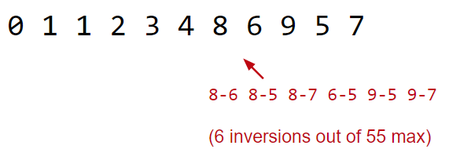

Goal of sorting:
- Given a sequence of elements with $Z$ inversions
- Perform a sequence of operations that reduces inversions to $0$

### Performance Definition

**Time Complexity**: Characterizations of the runtime efficiency of an algorithm:
- E.g.: DFS has time complexity $\Theta(V + E)$

**Space Complexity**: Characterizations of the _extra_ memory usage of an algorithm:
- E.g.: DFS has space complexity $\Theta(V)$
    * Note that the graph itself takes up space $\Theta(V + E)$, but we only care about the _extra_ space that DFS uses

## Selection Sort & Heap Sort

### Selection Sort

Selection sort: [demo](https://docs.google.com/presentation/d/1p6g3r9BpwTARjUylA0V0yspP2temzHNJEJjCG41I4r0/edit#slide=id.g463de7561_042)
- Find smallest item
- Swap this item to the front and _fix_ it
- Repeat for _unfixed_ items until all items are fixed

##### Performance {ignore=True .ignorenumbering}

Time complexity: $\Theta(N^2)$
- Seems inefficient: We look through entire remaining array every time to find the minimum

Space complexity: $\Theta(1)$

### Heap Sort

Idea: Instead of rescanning entire array looking for minimum, maintain a heap so that getting the minimum is fast !

#### Naïve Heap Sort

Naïve heap-sorting $N$ items: [demo](https://docs.google.com/presentation/d/1HVteFyWOxBW4mmUgkDnpUoTkWexiHt7Ei30Qolbc_I4/edit#slide=id.g463de7561_042)
- Insert all items into a _max_ heap, and discard input array and create output array
- Repeat $N$ times:
    * Delete largest item from the max heap
    * Put largest item at the _end_ of the unused part of the output array

(Why _max_ heap ?: Because takes advantages when [in-place heap sort](#in-place-heap-sort))

##### Performance {ignore=True .ignorenumbering}

Time complexity: **$O(N \log N)$**
- Getting items into the heap $O(N \log N)$ time
- Selecting largest item: $\Theta(1)$ time for each selection
- Removing largest item: $O(\log N)$ for each removal
- Overall runtime $O(N \log N) + \Theta(N) + O(N \log N) = O(N \log N)$

Space complexity: **$\Theta(N)$** to build the additional copy of all the data in the original array 
- Worse than selection sort, but probably not big deal
- Can eliminate this extra memory cost with some fancy trick: [in-place heap sort](#in-place-heap-sort)

#### In-place Heap Sort

Alternative approach: Treat the input array as a heap itself !: 
- Rather than inserting into a new array of length $N + 1$, use a process known as **_bottom-up-heapification_** to convert the array into a heap
- Avoids need for extra copy of all data
- Once heapified, algorithm is almost the same as naïve heap sort

In-place heap sort algorithm: [demo](https://docs.google.com/presentation/d/1z1lCiLSVLKoyUOIFspy1vxyEbe329ntLAVDQP3xjmnU/edit#slide=id.g463de7561_042)
- Bottom-up heapify input array:
    * Sink nodes in _reverse level order_: `sink(k)`
    * After sinking, guaranteed that tree rooted at position `k` is a heap
- Repeat $N$ times:
    * Delete largest item from the max heap, swapping root with last item in the heap

##### Performance {ignore=True .ignorenumbering}

Time complexity: $O(N \log N)$
- **Bottom-up heapification: $O(N \log N)$**
    * $N$ `sink` operations, each taking no more than $O(\log N)$
- Selecting largest item: $\Theta(1)$
- Removing largest item: $O(\log N)$ for each removal

**Memory complexity: $\Theta(1)$ !**
- The only extra memory we need is a constant number instance variables, e.g.: size
- If we employ recursion to implement various heap operations, space complexity is $\Theta(\log N)$ due to need to track recursive calls, but the difference between $\Theta(\log N)$ and $\Theta(1)$ space is effectively nothing

## Merge Sort

Merge sort: [demo](https://docs.google.com/presentation/d/1h-gS13kKWSKd_5gt2FPXLYigFY4jf5rBkNFl3qZzRRw/edit)
- Recursive algorithm:
    * Split items into 2 roughly even pieces
    * Merge sort each half
    * Merge the two sorted halves to form the final result

##### Performance {ignore=True .ignorenumbering}

- Time complexity: $\Theta(N \log N)$ ([Analysis](week7.html#merge-sort))
- Space complexity: with aux array: $\Theta(N)$

Note: In-place marge sort is possible, but the algorithm is very complicated and runtime suffers by a significant constant factor

## Insertion Sort

General idea:
- Starting with an empty output sequence
- Add each item from input, inserting into output at _right point_

Naïve approach: Build entirely new output: [demo](https://docs.google.com/presentation/d/181Lhn8jf4N-VG1BOkV4-Caj1wKcavkls8fnTKJlCuXc/pub?start=false&loop=false&delayms=3000&slide=id.g463de7561_042)

### In-place Insertion Sort

More efficient approach: Do everything in-place using swapping: [demo](https://docs.google.com/presentation/d/10b9aRqpGJu8pUk8OpfqUIEEm8ou-zmmC7b_BE5wgNg0/edit#slide=id.g463de7561_042)
- Repeat for `i = 0` to `i = N - 1`
    * Designate item `i` as the traveling item
    * Swap item backwards until traveler is in the right place among all previously examined items

### Performance

Example:
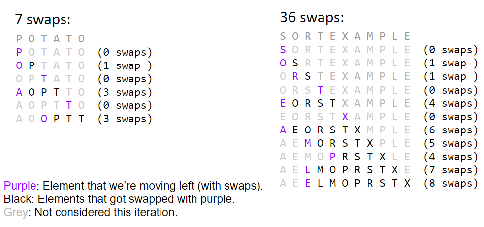

Time complexity: $\Omega(N), O(N^2)$

### Sweet Spots of Insertion Sort

#### On _Almost Sorted_ Array

For arrays that are almost sorted, insertion sort does very little work:
- Left array: 5 inversions, so only 5 swaps
- Right array: 3 inversions, so only 3 swaps

On arrays with a small number of inversions, insertion sort is extremely fast:
- One exchange per inversion (and number of comparisons is similar)
    * **Runtime is $\Theta(N + K)$ where $K$ is number of inversions**
- Let's define an **_almost sorted array_** as one in which number of inversions $\leq cN$ for some $c$, and insertion sort is excellent on these arrays

#### On Small Array

For small arrays ($N < 15$ or so), insertion is fastest:
- More of an empirical fact than a theoretical One
- Rough idea: Divide and conquer algorithms like Heap sort / Merge sort spend too much time dividing, but insertion sort goes straight to the conquest
- The Java implementation of merge sort does this

## Appendix - Shell Sort

Big idea: Fix multiple inversions at once:
- Instead of comparing adjacent items, compare items that are one stride length $h$ apart
- Start with large stride, and decrease towards 1
    * E.g.: $h = 7, 3, 1$

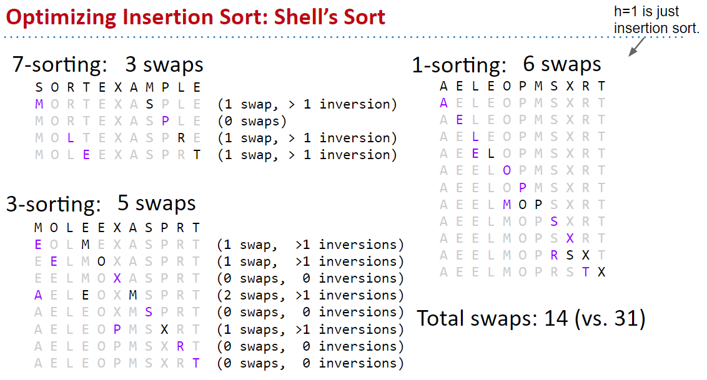

$h = 1$ is just normal insertion sort:
- By using large strides first, fixes most of the inversions

Strides can generalized to $2^k - 1$ from some $k$ down to $1$:
- Requires $\Theta(N^{1.5})$ time in the worst case
- Other stride patterns can be faster:
    * 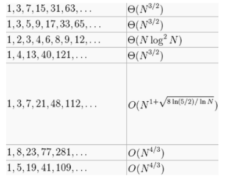

## Summary

| Algorithm                                             | Best Case Runtime  | Worst Case Runtime       | Space       | Demo                                                                                                                     | Notes                                 |
|-------------------------------------------------------|--------------------|--------------------------|-------------|--------------------------------------------------------------------------------------------------------------------------|---------------------------------------|
| [Selection Sort](#selection-sort)                     | $\Theta(N^2)$      | $\Theta(N^2)$            | $\Theta(1)$ | [Link](https://docs.google.com/presentation/d/1p6g3r9BpwTARjUylA0V0yspP2temzHNJEJjCG41I4r0/edit#slide=id.g463de7561_042) | N/A                                   |
| [Heap Sort (in-place)](#in-place-heap-sort)           | $\Theta(N)$        | $\Theta(N \log N)$       | $\Theta(1)$ | [Link](https://docs.google.com/presentation/d/1z1lCiLSVLKoyUOIFspy1vxyEbe329ntLAVDQP3xjmnU/edit#slide=id.g463de7561_042) | Bad cache performance                 |
| [Merge Sort](#merge-sort)                             | $\Theta(N \log N)$ | $\Theta(N \log N)$       | $\Theta(N)$ | [Link](https://docs.google.com/presentation/d/1h-gS13kKWSKd_5gt2FPXLYigFY4jf5rBkNFl3qZzRRw/edit)                         | Fastest of these                      |
| [Insertion Sort (in-place)](#in-place-insertion-sort) | $\Theta(N)$        | $\Theta(N^2)$            | $\Theta(1)$ | [Link](https://docs.google.com/presentation/d/10b9aRqpGJu8pUk8OpfqUIEEm8ou-zmmC7b_BE5wgNg0/edit#slide=id.g463de7561_042) | Best for small $N$ or _almost sorted_ |
| [Shell Sort](#shell-sort)                             | $\Theta(N)$        | $\Omega(N \log N), O(?)$ | $\Theta(1)$ | N/A                                                                                                                      | Rich theory !                         |

# Lec.33 - Quick Sort

## History

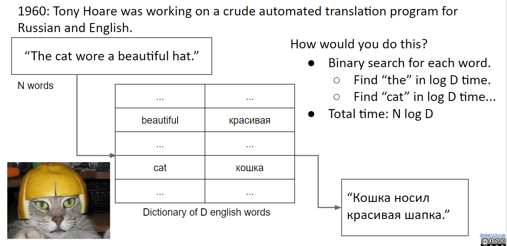

Algorithm: $N$ binary searches of $D$ length dictionary:
- Total runtime: $N \log D$
- ASSUMES $\log$ time binary search !

Limitations at that time:
- Dictionary stored on long piece of tape, sentence is an array in RAM
    * Binary search of tape is not $\log$ time (requires physical movement !)
- Better: **Sort the sentence** and scan dictionary tape once: $N \log N + D$ time
    * {++But Tony had to figure out how to sort an array WITHOUT Google...++} => (Strange Algorithm) Quick sort

## Partitioning

To **partition** an array `ary[]` on element `x = ary[i]` is to rearrange `ary[]` so that:
- `x` moves to position `j` (may be same as `i`)
- All entries to the left of `x` are `<= x`
- All entries to the right of `x` are `>= x`

| Before partitioning | {>>img<<}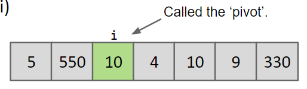 |
|---------------------|---------------------------------------------------------------|
| After partitioning  | {>>img<<}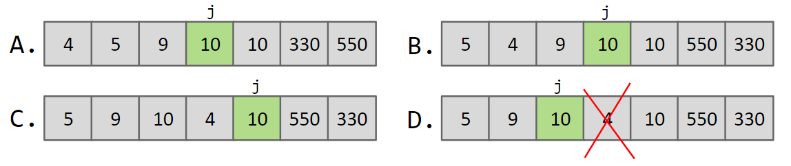  |

### Algorithm {ignore=True .ignorenumbering}

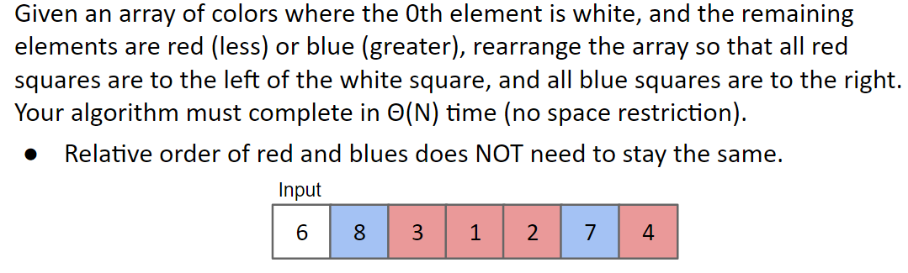

There're many ways to implement partitioning.

#### Algorithm 1: 3 Scan Approach {ignore=True .ignorenumbering}

Create an empty array:
- Scan 1: Copy all the red items to the first $R$ spaces
- Scan 2: Copy the white item
- Scan 3: Copy all the blue items to the last $B$ spaces

Runs in $\Theta(N)$ time

#### Algorithm 2: Sticking {ignore=True .ignorenumbering}

Create an empty array:
- Iterate through the original array:
    * If item is blue, stick at the right end
    * If red, stick on left end

Runs in $\Theta(N)$ time

## Quick Sort

Partitioning example:

Observations on partitioning:
- 5 is _in its place_: Exactly where it'd be if the array were sorted
- Can sort two halves separately, e.g.: through recursive use of partitioning

**Quick sort algorithm**: [Demo](https://docs.google.com/presentation/d/1QjAs-zx1i0_XWlLqsKtexb-iueao9jNLkN-gW9QxAD0/edit#slide=id.g463de7561_042)
- Partition on _some_ item
- Quick sort left half
- Quick sort right half

## Performance

### Best Case Runtime

Best case: Pivot always lands in the middle

Overall runtime: $\Theta(N \log N)$
- Total work at each level: $N$
- The number of layer: $\log N$

### Worst Case Runtime

Worst case: Pivot always lands at beginning of array
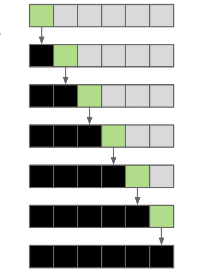

Runtime: $\Theta(N^2)$

### Then, Is Quick Sort Really _Fastest_ ??

$\Theta(N \log N)$ vs. $\Theta(N^2)$ is a **{++really big deal++}**:
- How can quick sort be the fastest sort empirically ?
- => Because on average it is $\Theta(N \log N)$

#### Augment #1: 10% Case

Suppose pivot always ends up at least 10% from either edge (not to scale):
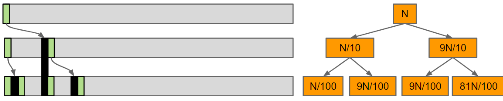

**Overall runtime is still $O(N \log N)$**:
- Work at each level: $O(N)$
- The number of layers: $\log_{10/9} N$ = $O(\log N)$

Punchline: Even if we are unlucky enough to have a pivot that never lands anywhere near the middle, but at least always 10% from the edge, runtime is still $O(N \log N)$

#### Argument #2: Quick Sort is BST Sort

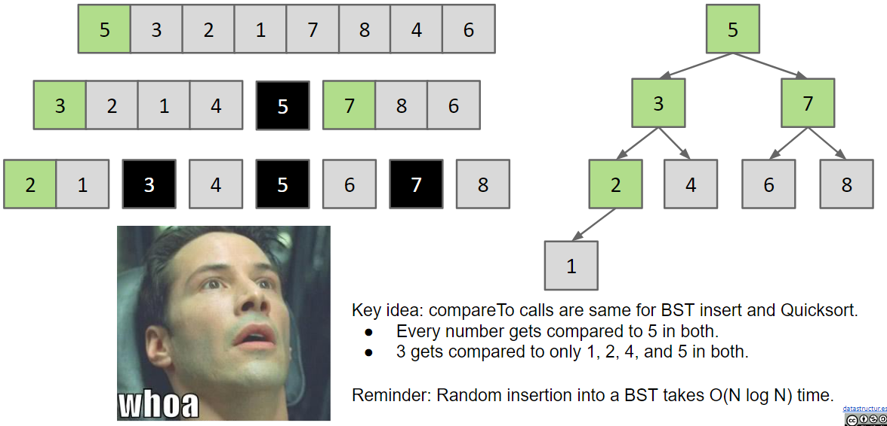

#### Argument #3: Quick Sort Runtime

For $N$ items:
- Mean number of compares to complete Quick Sort: $\sim 2N \log N$
- Standard deviation: $\sqrt{(21 - 2\pi^2) / 3}N \simeq 0.6482776 N$

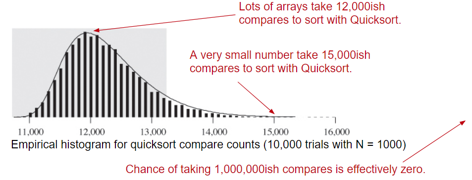

#### Summary

Theoretical analysis:
- Best case: $\Theta(N \log N)$
- Worst case: $\Theta(N^2)$
- **Randomly chosen array case: $\Theta(N \log N)$** expected with extremely high probability

Why is it faster than Merge Sort ($\Theta(N \log N)$ in best/worst)
- Requires empirical analysis, no obvious reason why.

## Avoiding Worst Case

The performance of Quick Sort (both order of growth and constant factors) depend critically on:
- How we select our pivot
    * In [demo](https://docs.google.com/presentation/d/1QjAs-zx1i0_XWlLqsKtexb-iueao9jNLkN-gW9QxAD0/edit#slide=id.g463de7561_042), leftmost item is always chosen as the pivot
- How we partition around that pivot
    * In [demo](https://docs.google.com/presentation/d/1QjAs-zx1i0_XWlLqsKtexb-iueao9jNLkN-gW9QxAD0/edit#slide=id.g463de7561_042), partitioning preserves the relative order of `<=`  and `>=` items
- Other optimizations we might add to speed things up

**Worst case do happen in practice !**:
- Bad ordering: Array already in sorted order (or almost sorted order)
- Bad elements: Array with all duplicates

Four philosophies to avoid running into the worst case:
- **Randomness**: Pick a random pivot or shuffle before sorting
- **Smarter pivot selection**: Calculate or approximate the median
- **Introspection**: Switch to a safer sort if recursion goes to deep
- **Preprocess the array**: Could analyze array to see if Quick Sort will be slow. No obvious way to do this though (can't just check if array is sorted, almost sorted array are almost slow)

### Philosophy #1: Randomness

Dealing with bad ordering:
- Strategy #1: Pick Pivots randomly
- Strategy #2: Shuffle the array before we sort
    * Still requires care in partitioning code to avoid $\Theta(N^2)$ behavior on arrays of duplicates

### Philosophy #2: Smarter Pivot Selection

Randomness is necessary for best Quick Sort performance:
- Any other deterministic / constant time pivot selection has a family of dangerous inputs that an adversary could easily generate: [A Killer Adversary for Quicksort](https://www.cs.dartmouth.edu/~doug/mdmspe.pdf)

#### Linear Time Pivot Pick {ignore=True .ignorenumbering}

Could calculate the actual median in linear time:
- _Exact median Quick Sort_ is safe: Worst case $\Theta(N \log N)$, but it is slower than Merge Sort

### Philosophy #3: Introspection

Can also simply watch our recursion depth:
- If it exceeds some critical value (say $10 \log N$), switch to Merge Sort
- Perfectly reasonable approach, though not super common in practice

## Summary

|                   | Memory                    | Time                        | Notes                        |
|-------------------|---------------------------|-----------------------------|------------------------------|
| Heap Sort         | $\Theta(1)$               | $\Theta(N \log N)$          | Bad caching                  |
| Insertion Sort    | $\Theta(1)$               | $\Theta(N^2)$               | $\Theta(N)$ if almost sorted |
| Merge Sort        | $\Theta(N)$               | $\Theta(N \log N)$          | N/A                          |
| Random Quick Sort | $\Theta(\log N)$ expected | $\Theta(N \log N)$ expected | Fastest sort                 |
