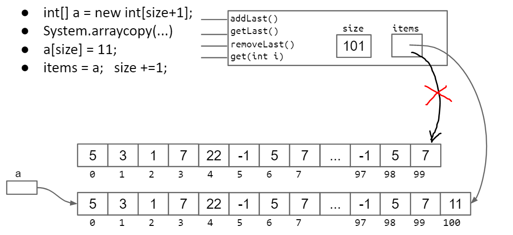
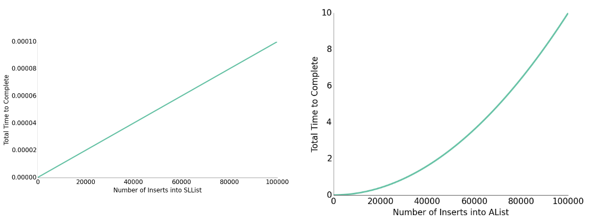
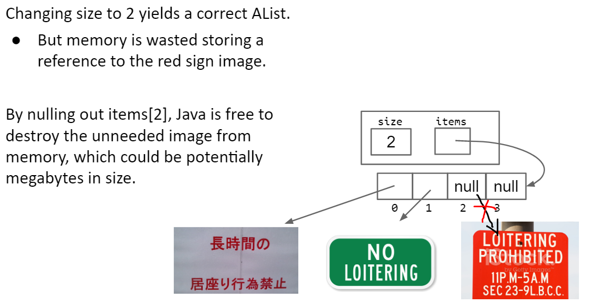
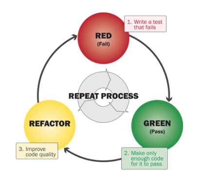
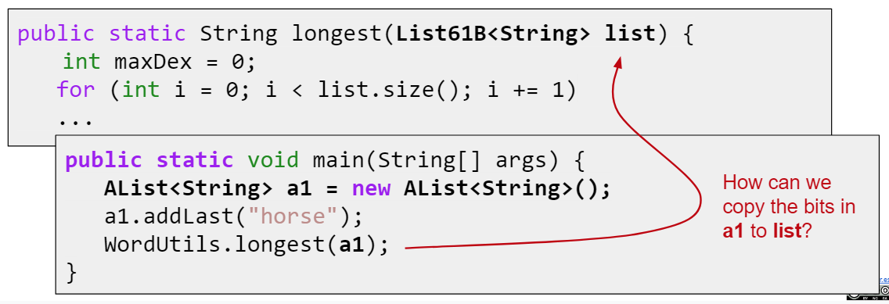
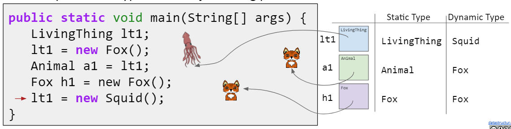

---
html:
    embed_local_images: true
    toc: true
toc:
    depth_from: 1
    depth_to: 2
    ordered: false
export_on_save:
    html: true
---

<!-- Importing styles for numbering sections from H1 -->
<!-- @import "C:\Users\aviat\.atom\mpe-styles\numbering-from-h1.less" -->
<!-- Importing fancy github-light theme -->
<!-- @import "C:/Users/aviat/.atom/mpe-styles/fancy-github-light.less" -->


# Week 3 - Lec.6 & Lec.7 & Lec.8 {ignore=True .ignorenumbering}


## TOC {ignore=True .ignorenumbering}

<!-- @import "[TOC]" {cmd="toc" depthFrom=1 depthTo=2 orderedList=false} -->
<!-- code_chunk_output -->

* [Lec.6 - Arrays and Lists](#lec6-arrays-and-lists)
	* [Naïve Implementation of Array-based List](#naïve-implementation-of-array-based-list)
	* [Resizing Arrays](#resizing-arrays)
	* [Generic Array](#generic-array)
	* [Appendix: Obscurantism](#appendix-obscurantism)
* [Lec.7 - Testing](#lec7-testing)
	* [An Example Flow of Testing](#an-example-flow-of-testing)
	* [What's The Test All About After All ?](#whats-the-test-all-about-after-all)
	* [Better JUnit](#better-junit)
	* [Testing Philosophy](#testing-philosophy)
* [Lec.8 - Interface and Implementation Inheritance](#lec8-interface-and-implementation-inheritance)
	* [Interface](#interface)
	* [Implementation Inheritance](#implementation-inheritance)
	* [Static Type and Dynamic Type, Dynamic Method Selection](#static-type-and-dynamic-type-dynamic-method-selection)
	* [Summary](#summary)

<!-- /code_chunk_output -->


# Lec.6 - Arrays and Lists

## Problem With List: Arbitrary Retrieval {ignore=True .ignorenumbering}

Suppose we added `get(int i)` method, which return the `i`th item from the list.

`get()` can be slow for long lists:
- Have to scan to desired position. Slow for any `i` not near the sentinel node
    * (We will discuss (much later) sophisticated changes that can speed up lists)
- For now: We'll take different tack - Using an array as an underlaying structure instead (no links !)

##### Random Access in Arrays {ignore=True .ignorenumbering}

Retrieval from any position of an array is very fast.
- *Independent* of array size
    * Ultra fast random access results from the fact that memory boxes are the same size (in bits)


## Naïve Implementation of Array-based List

> AList.java
```java
/** Array based list.
 * 
 * # Sample check
 * index:  0  1  2  3  4  5
 * items: [1, 2, 3, 4, 0, 0, ...]
 *  size: 4
 *
 * # Invariants
 * addLast: The next item will go into position size
 * getLast: The item to be returned is in position size - 1
 * size: The number of items in the list should be size
 */
public class AList {
    private int[] items;
    private int size;

    /** Creates an empty list. */
    public AList() {
        items = new int[100];
        size = 0;
    }

    /** Inserts X into the back of the list. */
    public void addLast(int x) {
        items[size] = x;
        size += 1;
    }

    /** Returns the item from the back of the list. */
    public int getLast() {
        return items[size - 1];
    }

    /** Gets the ith item in the list (0 is the front). */
    public int get(int i) {
        return items[i];
    }

    /** Returns the number of items in the list. */
    public int size() {
        return size;
    }
    
    /** Deletes item from back of the list and
     * returns deleted item. */
     public int removeLast() {
        int returnItem = getLast();
        // Note that we don't need: `items[size - 1] = 0;`
        size -= 1;
        return returnItem;
    }
}
```


## Resizing Arrays

When the array gets too full (`size == items.length`), but want to insert item (e.g. `addLast(1)`), **just make a new array**.[^discarded-array]

[^discarded-array]: The discarded array will be destroyed by the *Garbage Collector*.



> AList.java
```java
public class AList {    
    ...

    /**
     * Resizes the underlying array to the target capacity. *
     * (Note that this method works very slow.)
     */
    private void resize(int capacity) {
        int[] a = new int[capacity];
        System.arraycopy(items, 0, a, 0, size);
        items = a;
    }

    /**
     * Inserts X into the back of the list.
     */
    public void addLast(int x) {

        /* Resizes when the array's been full */
        if (size == items.length) {
            int newCapacity = size + 1;
            resize(newCapacity);
        }

        items[size] = x;
        size += 1;
    }
    
    ...
}
```

### Harder Resizing Analysis

Q.) Suppose we have a full array of `size == 100`. If we call `addLast` until `size == 1000`, roughly how many total array memory boxes will we need to create and fill ?
- A.) $500,000$
    * $101 + 102 + ... + 1000 = O(1000 \times (1000 + 1) / 2)$



e.g.) Inserting million ($10^6$) items to array requires roughly $5 \times 10^{11}$ new containers, but to list only $10^6$.
- *Computers operate at speed of GHz (due billions of things per second: $O(10^9)$)*

| > $ time java SpeedTestSLList | > $ time java SpeedTestAList |
|-------------------------------|------------------------------|
| `real    0m0.552s`            | `real    0m3.562s`           |

### Geometric Resizing

Geometric resizing is surprisingly much faster.

> AList.java

{--resize(newCapacity);--}
{++resize(newCapacity * RFACTOR);++}

```java
public void addLast(int x) {

    /* Resizes when the array's been full */
    if (size == items.length) {
        int newCapacity = size + 1;
        resize(newCapacity * 10); // factor by 10
    }

    items[size] = x;
    size += 1;
}
```

| > $ time java SpeedTestSLList | > $ time java SpeedTestAList |
|-------------------------------|------------------------------|
| `real    0m0.552s`            | **`real    0m0.225s`**       |

### Memory Efficiency

Suppose we have a very rare situation occur which causes us to:
- Insert 1,000,000,000 items
- Then remove 990,000,000 items

An `AList` should no only be efficient in time, but also efficient in space.
- Define the *usage ratio* `R = size / items.length`
- Typical solution: Half array size when `R < 0.25`

Note there are usually trade-offs between time and space efficiency for a variety of algorithms and data structures.


## Generic Array

##### Notes with Generic Arrays {ignore=True .ignorenumbering}
- When creating an array of references to generic type `Item`:
    * `(Item []) new Object[100];`
        + Causes a compiler warning, which we should ignore
- Why not just `new Item[100];`
    * Will cause a `generic array creation` error

> AList.java

```java
public class AList<Item> {
    
    private Item[] items;
    private int size;

    public AList() {
        items = (Item[]) new Object[100];
        size = 0;
    }

    private void resize(int capacity) {
        Item[] a = (Item[]) new Object[capacity];
        System.arraycopy(items, 0, a, 0, size);
        items = a;
    }

    public void addLast(Item x) {

        if (size == items.length) {
            int newCapacity = size + 1;
            resize(newCapacity * 5);
        }

        items[size] = x;
        size += 1;
    }

    public Item getLast() {
        return items[size - 1];
    }

    public Item get(int i) {
        return items[i];
    }
    
    public int size() {
        return size;
    }

    public Item removeLast() {
        Item returnItem = getLast();
        size -= 1;
        return returnItem;
    }

} 
```

### Loitering {ignore=True .ignorenumbering}

Unlike integer based `AList`, we actually want to *null out* deleted items
- Java only destroys unwanted objects when the last reference has been lost
- Keeping references to unneeded objects is sometimes called **loitering**
- *Save memory, don't loiter*.




## Summary: `ALists` {ignore=True .ignorenumbering}

- Even with the sophisticated Doubly Linked List (`DLList`), it's still take a long time to traverse through the list
    * Array offers constant access time
    * But array itself can't add or remove items
- Array-based List (`AList`) is:
    - A list class that takes advantage of *both* an **array's constant access time** and a **linked list's adding and removing feature**
    - Its underlying structure is an array. To support add and remove, we will choose to **resize** the array when the array is too full or too empty


## Appendix: Obscurantism

We talk of "layers of abstraction" often in computer science
- We also rely on Obscurantism. The user of a class does not and should not know how it works
    * The Java language allows us to enforce this with ideals like `private` !
- A good programmer *obscures details from themselves, {++even with in a class++}*.
    * e.g.) `addFirst` and `resize` should be written totally independently. We should not be thinking about the details of one method while writing the other. Simply trust that the other works.
    * Breaking programming tasks down into small pieces (especially functions) helps with this greatly !
    * Through judicious use of testing, we can build confidence in these small pieces (see [Lec.7 - Testing](#lec7-testing)).


# Lec.7 - Testing

### How Does A Programmer Know Their Code Works ? {ignore=True .ignorenumbering}

In the real world, programmers believe their code works **because of tests they write themselves**.
- We'll start by writing **test first !**


## An Example Flow of Testing

As an example, let's write `sort` method to sort an array of strings as well as our own test for it.

- [MySort.java](../lectureCode-sp18/testing/MySort.java)
- [MyTestSort.java](../lectureCode-sp18/testing/MyTestSort.java)

### Ad-Hoc Testing vs. JUnit {ignore=True .ignorenumbering}

Ad-Hoc testing can be tedious. Example below.

> MyTestSort.java
```java
/** Tests the the MySort class. */
public class MyTestSort {
    /** Test the MySort.sort method. */
    public static void testSort() {
        String[] input = {"i", "have", "an", "egg"};
        String[] expected = {"an", "egg", "have", "i"};

        MySort.sort(input);

        for (int i = 0; i < input.length; i++) {
            if (!input[i].equals(expected[i])) {
                System.out.println("Mismatching in position " + i + ", expected: " + expected[i] + ", but got:" + input[i]);
            }
            return;
        }
    }

    public static void main(String[] args) {
        testSort();
    }
}
```

##### JUnit: A library for making testing easier {ignore=True .ignorenumbering}
- Saves us the trouble of writing code like above.

```java
/** Tests the the MySort class. */
public class MyTestSort {
    /** Test the MySort.sort method. */
    public static void testSort() {
        String[] input = {"i", "have", "an", "egg"};
        String[] expected = {"an", "egg", "have", "i"};

        MySort.sort(input);

        org.junit.Assert.assertArrayEquals(expected, input);
    }
    
    ...
}
```

### Selection Sort {ignore=True .ignorenumbering}

Selection sorting a list of `N` items:
- Find the smallest item
- Swapping it for the front
- Selection sort the remaining `N - 1` items (without touching front item)


#### Tricky Problem {ignore=True .ignorenumbering}

Without changing the method signature of `public static void sort(String[] input)`, how can we use recursion ? What might the recursive call look like ?

```java
/**
 * Sorts strings destructively
 */
public static void sort(String[] input) {
    int smallest = findSmallest(x);
    swap(input, 0, smallest);
    // recursive call
}
```

##### Not Working (But Tempting) Solution {ignore=True .ignorenumbering}
> Python
```python
sort(x[1:]) // sub-indexing
```
Some languages support sub-indexing into arrays like above
- But *Java does not*
- Bottom line: No way to get address of the middle of an array

##### Java Solution {ignore=True .ignorenumbering}

Use helper method in Java.
```java
public static void sort(String[] x) {
    sort(x, 0);
} 
/** Destructively sorts x starting at position start */
public static void sort(String[] x, int start) {
    int smallest = findSmallest(x);
    swap(x, start, smallest);
    sort(x, start + 1);
}
```

### Summary: The Evolution of Our Design {ignore=True .ignorenumbering}

1. Created `MyTestSort()`
2. Created a `sort` skeleton: `sort(String[] input)`
3. Created `testFindSmalles`
4. Created `findSmallest`: `String findSmallest(String[] input)`
    * To compare strings, use `compareTo()` method
5. Created `testSwap`
6. Created `swap`: `swap(String[] input, int a, int b)`
7. Changed `findSmallest`: `int findSmallest(String[] input)`
8. Added helper method `sort(String[] input, int start)`
9. Used debugger to realize fundamental design flaw in `findSmallest`
10. Modified `findSmallest`: `int findSmallest(String[] input, int start)`


## What's The Test All About After All ?

Often, development is an incremental process that involves lots of tasks switching and on the fly design modification.

Tests provide *stability* and *scaffolding*.
- Provide confidence in basic units and mitigate possibility of breaking them
- Help us focus on one task at a time
    * By switching test units

In larger projects, tests also allow us to safely **refactor** ! Sometimes code gets ugly, necessitating redesign and rewrites ([proj2](../proj2)).


## Better JUnit

##### New syntax #1: `org.junit.Assert.assertEquals(expected, actual)`  {ignore=True .ignorenumbering}

- Tests that `expected` equals `actual`
- If not, program terminates with verbose message

Junit does much more:
- Other methods like `assertEquals` include `assertFalse`, `assertNotNull`, `assertArrayEquals`, etc.
    * c.f.) https://junit.org/junit4/javadoc/4.12/org/junit/Assert.html
- Other more complex behaviour to support more sophisticated testing ([lab3])

##### New Syntax #2: `@org.junit.Test` {ignore=True .ignorenumbering}

The messages output by JUnit are kind of ugly, and invoking each test manually is annoying (switching comment in and out).

Syntax `@org.junit.Test` solves them.
- *Annotate* each test with `@org.junit.Test`
- Change all test methods to non-static[^junit-non-static]
- Use a JUnit runner to run all test and tabulate results
    * IntelliJ provides a default runner/renderer. OK to delete `main`[^command-line-junit]
    * Rendered output is easier to read, no need to manually invoke (by commenting in and out) test !

[^command-line-junit]: If we want to use the command line instead, see the jh61b runner in the [lab3], but not preferred.

[^junit-non-static]: This weirdly implies it would be instantiating `TestSort.java`, and in fact JUnit runners do this. But even Josh doesn't know why.

[lab3]: ../lab3

##### New Syntax #3 {ignore=True .ignorenumbering}

It is annoying to type out the name of the library repeatedly, e.g.) `org.junit.Test` and `org.junit.Assert.assertEquals`.

To avoid this we'll start every test file with:
```java
import org.junit.Test;
import static org.junit.Assert.*;
```

This will magically eliminate the need to type `org.junit` or `org.junit.Assert` (more after the midterm on what these `import`s really mean)


## Testing Philosophy

### Correctness Tool #1: Naïve Workflow {ignore=True .ignorenumbering}

1. Read and (mostly) understand the spec
2. Write entire program
3. Compile and fix all compilation errors
4. Until correct, repeat randomly:
    - Run program (on Autograder)
    - Add `print` statements to zero in on the bug
    - Make changes to code to try to fix bug

This workflow is slow and unsafe !

### Correctness Tool #2: Unit Tests {ignore=True .ignorenumbering}

##### Idea: Write tests for every *unit*. {ignore=True .ignorenumbering}
- JUnit makes this easy !

##### Why ? {ignore=True .ignorenumbering}
- Build confidence in basic modules
- Decrease debugging time
- Clarify the task

##### Why not ? {ignore=True .ignorenumbering}
- Building tests takes time
- May provide *false confidence*
- **Hard to test units that rely on others**
    * e.g.) How do we test `addFirst` ?

#### Test-Driven-Development (TDD) {ignore=True .ignorenumbering}

Steps to developing according to TDD:
- Identify a new feature
- Write a unit test for that feature
- Run the test. It should fail (RED)
- Write code that passes test (GREEN)
    * Implementation is certifiably good !
- Optional: Refactor code to make it faster, cleaner, etc.



Interesting perspective by the creator of Ruby on Rails and others: [Red-Shirt, Red, Green, Refactor](http://ryantablada.com/post/red-green-refactor---a-tdd-fairytale)

### Correctness Tool #3: Integration Testing {ignore=True .ignorenumbering}

TDD is an extreme departure from the naïve workflow, and what's the best for us is probably in the middle.

##### Idea: Tests cover many units at once {ignore=True .ignorenumbering}
- Not JUnit's focus, but JUnit can do this

##### Why ? {ignore=True .ignorenumbering}
- Units testing is not enough to ensure modules interact properly or that system works as expected

##### Why not ? {ignore=True .ignorenumbering}
- Can be tedious to do manually
- Can be challenging to automate
- Testing at highest level of abstraction may miss subtle or rare errors

### Summary: Parting Thoughts {ignore=True .ignorenumbering}

- JUnit makes testing easy
- We should write test
    * **But not too many**
        + Only when they might be useful !
    * **Write tests first when it feels appropriate**


# Lec.8 - Interface and Implementation Inheritance

## The Desire for Generality {ignore=True .ignorenumbering}

**Overloading**: Java allows multiple methods with same name, but different parameters

- e.g.) Implement a method `longest` returning the longest string in `AList` or `SList` and suppose both have *exact* same method signatures

> WordUtils.java
```java
public class WordUtils {
    /** Returns the longest word in AList */
    public static String longest(AList<String> list) {
        ... // same operation
    }
    /** Returns the longest word in SList */
    public static String longest(SList<String> list) {
        ... // same operation
    }
    ...
}
```

While overloading works, it is a bad idea in the case of `longest`:
- Code is virtually identical. Aesthetically gross
- Won't work for future lists. If we create a `QList` class, have to make a third method
- **Harder to maintain**
    * e.g.) Suppose we find a bug in one of the methods, we fix it in the `SLList` version, and forget to do it in the `AList` version


## Interface

### Hypernyms and Hyponyms {ignore=True .ignorenumbering}

In natural languages, **Hypernyms** vs. **Hyponym** can deal with this problem. e.g.:
- Dog is *hypernym* of poodle, malamute, yorkie, etc.
- Poole is *hyponym* of dog.
- => [WordNet project](https://wordnet.princeton.edu/)

`SLList` and `AList` are both clearly some kind of list:
- List is a *hypernym* of `SLList` and `AList`

Expressing this in Java is a two-step process:
1. Define a reference type for our hypernym: `interface` class
2. Specify that `SLList` and `AList` are hyponyms of that type: `implement` keyword

### Step.1: `interface` class

We'll use the new keyword `interface` instead of `class`
- Idea: `Interface` is a specification of *what* a List is able to do, *not how* to do it.
    * No instance variables
    * No constructor
    * No `private` stuff

> List61B.java
```java
public interface List61B<Item> {
    void addFirst(Item x);
    void addLast(Item x);
    void insert(Item x, int position);
    Item getFirst();
    Item getLast();
    Item get(int i);
    Item removeLast();
    int size();
}
```

- Notes:
    - All methods in an interface are implicitly `public`, so we  can omit the `public` modifier.
    - > In addition, an interface can contain constant declarations. All constant values defined in an interface are implicitly public, static, and final. Once again, you can omit these modifiers.

### Step.2: `implement` keyword

Use the new `implement` keyword to tell the Java compiler that `SLList` and `AList` are hyponyms of `List61B`.

> AList.java
```java
public class AList<Item> implements List61B<Item> {
    ...
    public void addFirst(Item x); { ... }
    ...
}
```

Now we can implement `longest` method to work on either kind of list.

> WordUtils.java
```java
public class WordUtils {
    public static String longest(List61B<String> list) { ... }
    ...
}
```

#### Overriding vs. Overloading {ignore=True .ignorenumbering}

If a subclass has a method with the exact same signature as in the superclass, we say the subclass **overrides** the method.

> `AList` overrides `addFirst(Item x)`
```java
public interface List61B<Item> {
    void addFirst(Item x) { ... }
    ...
}
```
```java
public class AList<Item> implements List61B<Item> {
    ...
    public void addFirst(Item x) {
        ...
    }
    ...
}
```

Methods with the same name but different signatures are called **overloaded**.

> `abs` is overloaded
```java
public class Math {
    public int abs(int a) { ... }
    public double abs(double a) { ... }
    ...
}
```

#### Step.2$\alpha$: Adding the `@Override` Annotation

In 61B, we'll always mark every overriding method with the `@Override` annotation.

> e.g.) Mark `AList.java`'s overrding methods with `@Override`
```java
public class AList<Item> Implements List61B<Item> {
    ...
    @Override
    public void addFirst(Item x) { ... }
    ...
}
```

- The only effect of this tag is that code won't compile if it is not actually an overriding method
    * Even if we don't write `@Override`, subclass still overrides the method
    * `@Override` is just an optional remainder that we're overriding

##### Why use `@Override` ? {ignore=True .ignorenumbering}

- Main reason: Protects against typos
    * If we say `@Override`, but the method isn't actually overriding anything, we'll get a compile error
        + e.g.) `public void addFist(Item x)`
- Reminds programmer that method definition came from somewhere higher up in the inheritance hierarchy.

### Summary: Interface Inheritance {ignore=True .ignorenumbering}

Specifying the capabilities of a subclass using the `implements` keyword is known as **interface inheritance**.
- Interface: The list of all method signatures
- Inheritance: The subclass *inherits* the interface
- Specifies what the subclass can do, but not how
- **Subclasses {++must++} override all of these methods !**
- Such relationships can be *multi-generational*

#### Again: Copying the Bits {ignore=True .ignorenumbering}

- When we set `x = y` or pass a parameter, we're just copying the bits
- A memory box can only hold 64 bit addresses for the appropriate type
    * e.g.) `String x` can never hold the 64 bit address of a `AList`

Question:


Answer: If `X` is a superclass of `Y`, then memory boxes for `X` may contain `Y`
- An `AList` is a subclass of `List61B`
- Therefore `List61B` variables can hold `AList` addresses

Thus the code below should work:
> WordUtils.java
```java
public class WordUtils {
    ...
    public static void main(String[] args) {
        List61B<String> list = new SLList<String>();
        list.addFirst("elk");
    }
}
```


## Implementation Inheritance

Java also allows **implementation inheritance**.
- Subclasses can inherit signatures *AND* implementation.
    * c.f.) Interface Inheritance: Subclass inherits signatures, but *NOT* implementation

Use the `default` keyword to specify a method that subclasses should inherit from an **interface**.

> List61B.java
```java
public interface List61B<Item> {
    ...
    /** Prints the list. Works for ANY kind of list. */
    default void print() {
        for (int i = 0; i < size(); i = i + 1) {
            System.out.print(get(i) + " ");
        }
        System.out.println();
    }
}
```

Note we still need an interface, and we can use methods defined in the interface but no instance variables in a default method.

### Overriding Default Methods {ignore=True .ignorenumbering}

If we don't like a `default` method, we can simply override it.
- The `default print()` method can be slow with `SLList`

> SLList.java
```java
public interface SLList<Item> implements List61B {
    ...
    @Override
    public void print() {
        for (Node p = sentinel.next; p != null; p = p.next) {
            System.out.print(p.item + " ");
        }
        System.out.println();
    }
}
```


## Static Type and Dynamic Type, Dynamic Method Selection

### Q1 {ignore=True .ignorenumbering}

Try to predict the results.

> Animal.java
```java
public interface Animal {
    default void greet(Animal a) {
        System.out.println("hello animal !");
    }
    default void sniff(Animal a) {
        System.out.println("sniff animal");
    }
    default void flatter(Animal a) {
        System.out.println("u r cool animal");
    }
}
```
> Dog.java
```java
public class Dog implements Animal {
    void sniff(Animal a) {
        System.out.println("sniff dog");
    }
    void flatter(Dog a) {
        System.out.println("u r cool dog");
    }
}
```
> AnimalLauncher.java
```java
public class AnimalLauncher {
    public static void main(String[] args) {
        Animal a = new Dog();
        Dog d = new Dog()
        a.sniff(d);
        d.sniff(d);
    }
}
```

> **Answer**
```
sniff dog
sniff dog
```

### Static Type vs. Dynamic Type

- Every Java variable has a **compile-time type**, a.k.a. **static type**
    * This is the type specified at *declaration*. Never changes
- Variables also have a **run-time type** , a.k.a. **dynamic type**
    * This is the type specified at **instantiation** (e.g. when using `new`)



### Dynamic Method Selection

Suppose we call a method of an object using a variable with:
- compile-time type `X`
- run-time type `Y`

**Dynamic Method Selection**: If `Y` **overrides** the method, `Y`'s method is used instead.

Answer: Thus `a.sniff(d)` called `Dog.sniff(Animal a)`.

### Q2 {ignore=True .ignorenumbering}

Try to predict the results.

> AnimalLauncher.java
```java
public class AnimalLauncher {
    public static void main(String[] args) {
        Animal a = new Dog();
        Dog d = new Dog()
        a.flatter(d);
        d.flatter(d);
    }
}
```

> **Answer**
```
u r cool animal
u r cool dog
```

Why `a.flatter(d)` called `Animal.flatter(Animal a)` ?

### Dynamic Method Selection for Overloading

**Dynamic method selection plays no rule when it comes to overloaded methods**.

Answer: `Animal.flatter(Animal a)` and `Dog.flatter(Dog a)` have different signature (overloaded), thus dynamic method selection does not apply.


## Summary

### Interface Inheritance vs. Implementation Inheritance

- Interface Inheritance (a.k.a. *what*): Allows us to generalize code in a powerful, simple way.
- Implementation Inheritance (a.k.a. *how*): Allows code-reuse (Subclasses can rely on superclasses or interfaces)
    * e.g.) `print()` implemented in `List61B.java`
    * Gives another dimension of control to subclass designers: Can decide whether or not to override default implementations

**Important**: In both cases, we specify *is-a* relationships, but not *has-a*.
- Good: `Dog` implements `Animal`, `SLList` implements `List61B`
- Bad: `Cat` implements `Claw`, `Set` implements `SLList`

### The Dangers of Implementation Inheritance

Particular dangers of Implementation Inheritance:
- Makes it harder to keep track of where something was actually implemented (though a good IDE makes this better)
- Rules for resolving conflicts can be arcane.
    * e.g.) What if two interfaces both give conflicting default methods ?
- Encourages overly complex code (especially with novices)
    * Common mistake: *Has-a* vs. *Is-a* !
- Breaks **encapsulation** !
