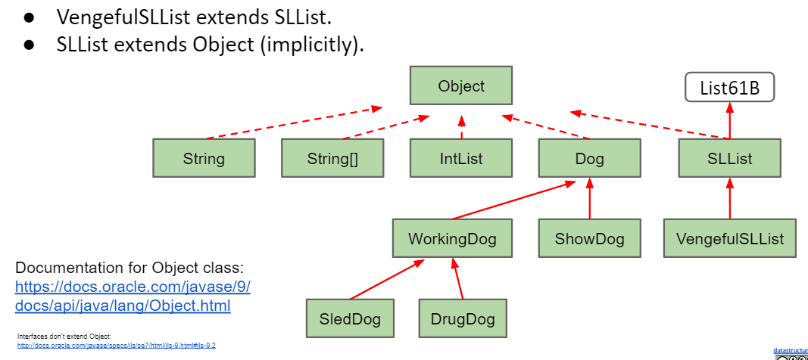
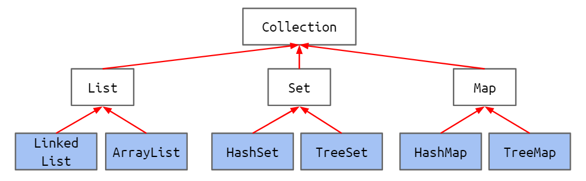
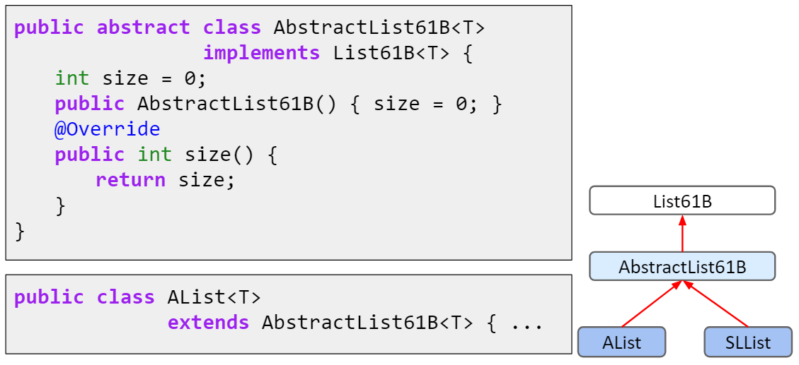
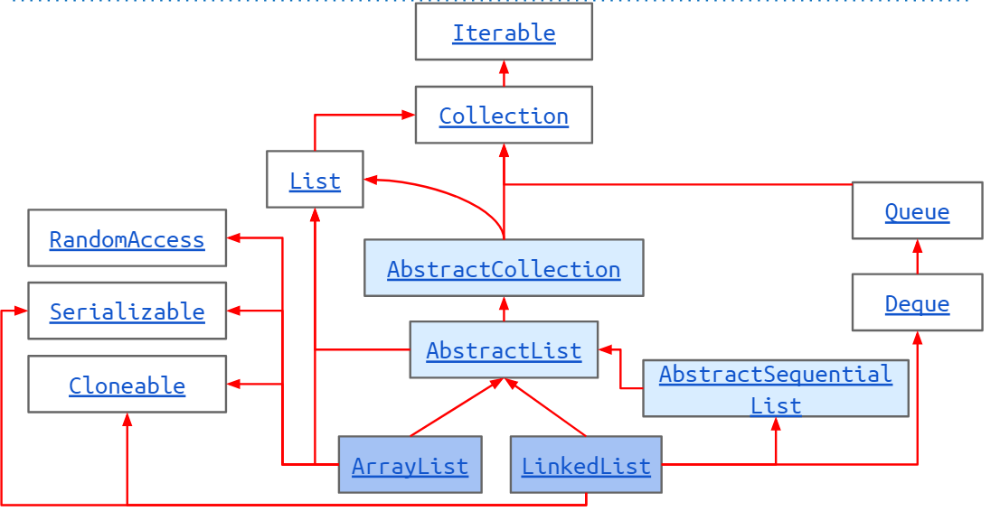

---
html:
    embed_local_images: true
    toc: true
toc:
    depth_from: 1
    depth_to: 2
    ordered: false
export_on_save:
    html: true
---

<!-- Importing styles for numbering sections from H1 -->
<!-- @import "C:\Users\aviat\.atom\mpe-styles\numbering-from-h1.less" -->
<!-- Importing fancy github-light theme -->
<!-- @import "C:/Users/aviat/.atom/mpe-styles/fancy-github-light.less" -->


# Week 4 - Lec.9 & Lec.10 & Lec.11 {ignore=True .ignorenumbering}

## TOC {ignore=True .ignorenumbering}

<!-- @import "[TOC]" {cmd="toc" depthFrom=1 depthTo=2 orderedList=false} -->
<!-- code_chunk_output -->

* [Lec.9 - More Inheritance !](#lec9-more-inheritance)
	* [Implementation Inheritance: Extends](#implementation-inheritance-extends)
	* [Encapsulation](#encapsulation)
	* [Type Checking and Casting](#type-checking-and-casting)
	* [Higher Order Functions](#higher-order-functions)
* [Lec.10 - Subtype Polymorphism vs. HoFs](#lec10-subtype-polymorphism-vs-hofs)
	* [Subtype Polymorphism](#subtype-polymorphism)
	* [`OurComparable`](#ourcomparable)
	* [`Comparable`](#comparable)
	* [`Comparator`](#comparator)
	* [Summary: `Comparable` and `Comparator`](#summary-comparable-and-comparator)
* [Lec.11 - Libraries](#lec11-libraries)
	* [Abstract Data Type](#abstract-data-type)
	* [Java Libraries](#java-libraries)
	* [Python vs. Java](#python-vs-java)
	* [Interface and Abstract Class](#interface-and-abstract-class)
	* [Packages](#packages)

<!-- /code_chunk_output -->


# Lec.9 - More Inheritance !

## Implementation Inheritance: Extends

c.f.) When a class is a hyponym of an interface, we used `implements`.
- e.g.) `SLList<Item> implements List61B<Item>`

If we want one class to be a hyponym of another *class* (instead of an interface), we use `extends`.

### e.g.1) Members Inherited

We'd like to build `RotatingSLList` that can perform any `SLList` operation as well as:
- `rotateRight()`: Moves back item the front

> RotatingSLList.java
```java
public class RotatingSLList<Item> extends SLList<Item> {
    public void rotateRight() {
        Item x = removeLast();
        addFirst(x);
    }
}
```

Because of `extends`, `RotatingSLList` inherits all members of `SLList`:
- All instance and static variables
- All methods
- All nested classes

But there are something not to be inherited:
- Constructors
- `private` members

### e.g.2) Constructor Behavior

Suppose we want to build `VengefulSLList` that:
- Remembers all items that have been destroyed by `removeLast`
- Has an additional method `printLostItems()`, which prints all deleted items

> VengefulSLList.java
```java
public class VengefulSLList<Item> extends SLList<Item> {
    
    SLList<Item> deletedItems;

    public VengefulSLList() {
        /** Implicitly calls `super();` */
        deletedItems = new SLList<Item>();
    }

    @Override
    public Item removeLast() {
        Item x = super.removeLast();
        deletedItems.addLast(x);
        return x;
    }

    public void printLostItems() {
        deletedItems.print();
    }
}
```

Constructors are not inherited. However, the rules of Java say that **all constructors must start with a call to one of the super class's constructors**.
- Idea: If every `VengefulSLList` *is-an* `SLList`, then every `VengefulSLList` must be set up like an `SLList`
    * If we didn't call `SLList` Constructor, sentinel would be null and it's very bad.
- We can explicitly call the Constructor with the keyword `super` (no dot)
- If we don't explicitly call the constructor, Java will {++automatically++} do it for us

E.g.) These two constructors below are exactly equivalent.
```java
public VengefulSLList() {
    deletedItems = new SLList<Item>();
}
```
```java
public VengefulSLList() {
    super();
    deletedItems = new SLList<Item>();
}
```

#### Calling Other Constructors {ignore=True .ignorenumbering}

If we want to use a `super` constructor other than the no-argument constructor, can give parameters to `super`.

E.g.) These two constructors below are **NOT** equivalent.

```java
public VengefulSLList(Item x) {
    super(x); // calls `SLList(Item x);`
    deletedItems = new SLList<Item>();
}
```
```java
public VengefulSLList(Item x) {
    // implicitly calls `SLList();`, not `SLList(x);`
    deletedItems = new SLList<Item>();
}
```

### The `Object` Class

As it happens, every type in Java is a descendant of the `Object` class



Documentation for `Object` class: https://docs.oracle.com/javase/9/docs/api/java/lang/Object.html
- Methods: `equals(Object obj)` & `toString()` are important

### *Is-A* vs. *Has-A*

**Important**: `extends` should only be used for ***is-a*** (hyponymic) relationships !

**Common mistake**: Use `extends` for ***has-a*** relationships.
- e.g.) Possible to extend `SLList` to build a `Set`, but conceptually weird, e.g. `get(int i)` doesn't make sense anymore, because sets are not ordered.


## Encapsulation

### Complexity: The Enemy

> When building large programs, our enemy is complexity.

Some tools for managing complexity:
- Hierarchical abstraction
    * Create **layers of abstraction**, with clear abstraction barriers !
        + e.g.) `AList` users don't need to know array is used under the hood
- > ***Design for change*** (D.Parnas)
    * Organize program around objects: Objective programming paradigm
    * Let objects decide how things are done: Interface, Implementation inheritance
    * **Hide information** others don't need: **Encapsulation**

### Modules and Encapsulation

***Modules***: A set of methods that work together as a whole to perform some task or set of related tasks

A module is said to be ***encapsulated*** if its implementation is {++completely hidden++}, and it can be accessed only through a documented interface.
- e.g.) We can't access `private` instance members of `ArrayDeque` like `resize` from outside of it,
    * Even when writing tests, we don't (usually) want to peer inside ([proj1b](https://github.com/aviatesk/cs61b-sp18/tree/master/proj1b), [proj1gold](https://github.com/aviatesk/cs61b-sp18/tree/master/proj1gold))

### Implementation Inheritance Breaks Encapsulation: e.g.


#### Q.1. {ignore=True .ignorenumbering}

Suppose we have a `Dog` class with the two methods shown below

> Dog.java
```java
public void bark() {
    System.out.print("bark");
}

public void barkMany(int N) {
    for (int i = 0; i < N; i++) {
        bark();
    }
    System.out.println();
}
```

And also we implemented `VerboseDog` class with implementation inheritance.

> VerboseDog.java
```java
@Override
public void barkMany(int N) {
    System.out.print("As a dog, I say: ");
    for (int i = 0; i < N; i++) {
        bark(); // calls inherited bark method
    }
    System.out.println();
}
```

**{++Question++}**
What would `VerboseDog.barkMany(3)` output ?

**{++Answer++}**
```
As a dog, I say: bark bark bark
```

#### Q.2. {ignore=True .ignorenumbering}

Then, someone maintaining `Dog` class changed it because of aesthetical reason like below.
- {++Note functionality is exactly the same, seen from the outside++} (meaning s/he thought this change is safe).
> Dog.java
```java
public void bark() {
    barkMany(1);
}

public void barkMany(int N) {
    for (int i = 0; i < N; i++) {
        System.out.print("bark");
    }
    System.out.println();
}
```

> VerboseDog.java
```java
@Override
public void barkMany(int N) {
    System.out.print("As a dog, I say: ");
    for (int i = 0; i < N; i++) {
        bark(); // calls inherited bark method
    }
    System.out.println();
}
```

**{++Question++}**
Then again, what would `VerboseDog.barkMany(3)` output ?

**{++Answer++}**

**We'll get caught in an infinite loop !**

By allowing implementation inheritance, we now have a way to peek inside of what was otherwise beautifully encapsulated.


## Type Checking and Casting

### Q.1. {ignore=True .ignorenumbering}

For each line of code below, determine:
- Does that line cause a compilation error ?
- Which method does dynamic method selection use ?

```java
public static void main(String[] args) {
    VengefulSLList<Integer> vsl = new VengefulSLList<Integer>(9);
    SLList<Integer> sl = vsl;
    
    sl.addLast(50);
    sl.removeLast();
    
    sl.printLostItems();
    VengefulSLList<Integer> vsl2 = sl;
    
    SLList<Integer> sl2 = new VengefulSLList<Integer>();
    VengefulSLList<Integer> vsl3 = new SLList<Integer>();
}
```

#### Reminder: Dynamic Method Selection {ignore=True .ignorenumbering}

If {++overridden++}, decide which method to call based on **run-time type (a.k.a. dynamic type)** of variable
- `sl`'s runtime type: `VengefulSLList`
- `sl.addLast(50);`: `VengefulSLList` doesn't override, thus uses `SLList`'s
- `sl.removeLast();`: Uses `VengefulSLList`'s

### Compile-Time Type Checking

Compiler *allows method calls* based on **compile-time type (a.k.a. static type)** of variable
- `sl`'s compile-time type: `SLList`
- `sl.printLostItems();`: Causes compilation error

Compiler also *allows assignments* based on compile-time types
- `sl`'s compile-time type: `SLList`
- `VengefulSLList<Integer> vsl2 = sl;`: Causes compilation error
    * Even though it's run-time type is `VengefulSLList`
    * Compiler plays it as safe as possible with type checking

### Compile-Time Types and Expressions: Ver.1

An expression using the `new` keyword ahs the specified compile-time type
- `SLList<Integer> sl2 = new VengefulSLList<Integer>();`
    * Compile-time type of right hand side (RHS) expression is `VengefulSLList`
    * A `VengefulSLList` *is-an* `SLList`, so assignment is allowed
- `VengefulSLList<Integer> vsl3 = new SLList<Integer>();`
    * Compile-time type of RHS expression is `SLList`
    * **An `SLList` is not necessarily a `VengefulSLList`**, so compilation error results

### Q.2. {ignore=True .ignorenumbering}

```java
public static Dog maxDog(Dog, d1, Dog d2) {...}
```

```java
Poodle frank = new Poodel("Frank", 5);
Poodle frankJr = new Poodel("Frank Jr.", 15);

Dog largerDog = maxDog(frank, frankJr);
Poodle largerPoodle = maxDog(frank, frankJr);
```

### Compile-Time Types and Expressions: Ver.2

Method calls have compile-time type equal to their declared type
- **Any call to `maxDog` will have compile-time type `Dog`** !
- `Dog largerDog = maxDog(frank, frankJr);`: OK
- `Poodle largerPoodle = maxDog(frank, frankJr);`: Causes compilation error !

### Casting

Java has a special syntax for specifying the compile-time type of any expression.
- Put desired type in parenthesis before the expression
- e.g.)
    * `maxDog(frank, franJr);`: Compile-time type `Dog`
    * `(Poodle) maxDog(frank, franJr);`: Compile-time type `Poodle`
    * `Poodle largerPoodle = (Poodle) maxDog(frank, frankJr);`: OK !

Casting is a powerful, but dangerous tool:
- Tells Java to treat an expression as having a different compile-time type
- Does not actually change anything:
    * **Think of casting as a way to trick the compiler**
    * > sunglasses don't make the world dark.

e.g.) The example below should get a `ClassCastExpression` error at *runtime*
```java
Poodle frank = new Poodle("Frank", 5);
Malamute frankSr = new Malamute("Frank Sr.", 100);

Poodle largePoodle = (Poodle) maxDog(frank, frankSr);
```
- So much for .class files being verifiably type checked...

##### Casting Rules {ignore=True .ignorenumbering}

- We can always *cast up* (to a more generic version of a class) without fear of ruining anything because we know the more specific version is a version of the generic class.
    * e.g.) We can always cast a `Poodle` to a `Dog` because all `Poodle`s are `Dog`s.
- We can also *cast down* (to a more specific version of a class) with caution as we need to make sure that, during runtime, nothing is passed in that violates our cast.
    * e.g.) Sometimes a `Dog` is a `Poodle` but not always
- We can't ever cast to a class that is NOT above or below the class being cast.
    * e.g.) We can't cast a `Dog` to a `Monkey` because a `Monkey` is not the direct lineage of a `Dog`

### Summary: Type Checking Rules {ignore=True .ignorenumbering}

- Compiler allows memory box to hold any subtype
- Compiler allows calls based on static type
- Overridden non-static methods are selected at run time based on dynamic type
    * Everything else is based on static type, including overloaded methods


## Higher Order Functions

**Higher Order Function**: A function that treats another function as data
- e.g.) takes a function as input

###### In Python {ignore=True .ignorenumbering}

```python
def tenX(x):
    return 10 * x
    
def do_twice(f, x):
    return f(f(x))
    
print(do_twice(tenX, 2))
```

###### In Java Old School (Version 7 and Earlier) {ignore=True .ignorenumbering}

Fundamental issue: Memory boxes (variables) can't contain pointers to functions
- **Can use an interface instead**: Example below

> IntUnaryFunction.java
```java
public interface IntUnaryFunction {
    int apply(int x);
}
```

> TenX.java
```java
public class TenX implements IntUnaryFunction {
    public int apply(int x) {
        return 10 * x;
    }
}
```

> HoFDemo.java
```java
public class HoFDemo {
    public static int do_twice(IntUnaryFunction f, int x) {
        return f.apply(f.apply(x));
    }
    
    public static void main(String[] args) {
        IntUnaryFunction tenX = new TenX();
        System.out.println(do_twice(tenX, 2));
    }
}
```

**{++Very verbose !!!++}**


# Lec.10 - Subtype Polymorphism vs. HoFs


## Subtype Polymorphism

**{++Polymorphism++}**: "providing a single interface to entities of different types"

e.g.) Consider a variable `deque` of static type `Deque`:
- When we call `deque.addFirst()`, the actual behavior is based on the dynamic type
- Java automatically selects the right behavior using what is called *dynamic method selection*


## e.g.) `max()` Function {ignore=True .ignorenumbering}

Suppose we want to write a function `max()` that returns the max of *any* array, regardless of type like below.

> Maximizer.java
```java
public static Object max(Object[] items) {
    int maxDex = 0;
    for (int i = 0; i < items.length; i += 1) {
        if (items[i] > items[maxDex]) {
            maxDex = i;
        }
    }
    return items[maxDex];
}
```
> DogLauncher.java
```java
public class DogLauncher {
    public static void main(String[] args) {
        Dog d1 = new Dog("Elyse", 3);
        Dog d2 = new Dog("Sture", 9);
        Dog d3 = new Dog("Benjamin", 15);
        Dog[] dogs = new Dog[]{d1, d2, d3};
        Dog maxDog = (Dog) Maximizer.max(dogs);
        maxDog.bark(); // Benjamin should bark
    }
}
```

But `items[i] > items[maxDex]` doesn't work: Objects can't be compared to other objects with `>`

### One (Bad) Way to Fix {ignore=True .ignorenumbering}

We can write a `max` method in the `Dog` class. But this approach has an obvious problem:
- We have to repeat the same work of implementing `max` methods in any other class, like `Cat`, `Horse`
- In effect, we have to give up on our dream true `max` function

## `OurComparable`

1. Create an interface that guarantees a comparison method
2. Have `Dog` implements this interface
3. Write `Maximizer` class in terms of this interface

> OurComparable.java
```java
public interface OurComparable {
    int ourCompareTo(Object obj);
}
```

> Dog.java
```java
public class Dog implements OurComparable {
    ...
    public int ourCompareTo(Object obj) {
        Dog comparedDog = (Dog) obj;
        return this.size - comparedDog.size;
    }
    ...
}
```

> Maximizer.java
```java
public class Maximizer {
    public static OurComparable ourMax(OurComparable[] items) {
        int maxDex = 0;
        for (int i = 0; i < items.length; i += 1) {
            int cmp = items[i].ourCompareTo(items[maxDex]);
            if (cmp > 0) {
                maxDex = i;
            }
        }
        return items[maxDex];
    }
}
```

> DogLauncher.java
```java
public class DogLauncher {
    public static void main(String[] args) {
        Dog d1 = new Dog("Elyse", 3);
        Dog d2 = new Dog("Sture", 9);
        Dog d3 = new Dog("Benjamin", 15);
        Dog[] dogs = new Dog[]{d1, d2, d3};
        Dog maxDog = (Dog) Maximizer.ourMax(dogs);
        maxDog.bark(); // Benjamin should bark
    }
}
```

##### Benefits of this approach: {ignore=True .ignorenumbering}

- No need for array maximization code in every custom type (i.e. no `Dog.maxDog(Dog [])`) function required
- Code that operates on multiple types (mostly) gracefully, e.g.:
```java
Comparable[] objs = getItems("somefile.txt");
return Maximizer.ourMax(objs);
```

## `Comparable`

##### Two issues with `OurComparable`: {ignore=True .ignorenumbering}

- Awkward casting to/from `Object`s: `Dog comparedDog = (Dog) obj`
- We made it up
    * No existing classes implement `OurComparable`: e.g. `String`
    * No existing classes use `OurComparable`: e.g. no built-in `max` function that uses `OurComparable`

##### The industrial strength approach

Use the built-in `Comparable` interface:
- Already defined and used by tons of libraries. *Uses generics*.

> Comparable.java **(Built-In)**
```java
public interface Comparable<T> {
    int compareTo(T obj);
}
```

> Dog.java
```java
public class Dog implements Comparable<Dog> {
    ...
    public int compareTo(Dog comparedDog) {
        return this.size - comparedDog.size;
    }
    ...
}
```

> Maximizer.java
```java
public class Maximizer {
    public static Comparable max(Comparable[] items) {
        int maxDex = 0;
        for (int i = 0; i < items.length; i += 1) {
            int cmp = items[i].compareTo(items[maxDex]);
            if (cmp > 0) {
                maxDex = i;
            }
        }
        return items[maxDex];
    }
}
```

> DogLauncher.java
```java
public class DogLauncher {
    public static void main(String[] args) {
        Dog d1 = new Dog("Elyse", 3);
        Dog d2 = new Dog("Sture", 9);
        Dog d3 = new Dog("Benjamin", 15);
        Dog[] dogs = new Dog[]{d1, d2, d3};
        Dog maxDog = (Dog) Maximizer.max(dogs);
        maxDog.bark(); // Benjamin should bark
    }
}
```

##### Benefits of this approach: {ignore=True .ignorenumbering}

- Avoids need for strange cast
    * Note still we need `Dog maxDog = (Dog) Maximizer.max(dogs);`
- Lots of built-in classes implement `Comparable`: e.g. `String`
- Lots of libraries use the `Comparable` interface: e.g.:
```java
Dog[] dogs = new Dog{d1, d2, d3};
Dog largest = Collections.max(Arrays.asList(dogs));
```


## `Comparator`

Suppose we want to write a program that prints a string representation of the larger of two objects according to some specific comparison function.

### Subtype Polymorphism vs. Explicit Higher Order Functions {ignore=True .ignorenumbering}

#### Explicit HoF approach {ignore=True .ignorenumbering}

```python
def print_larger(x, y, compare, stringify):
    if compare(x, y):
        return stringify(x)
    else:
        return stringify(y)
```

In some languages, we'd write two comparison functions and simply pass the one we want: Explicit HoF approach


#### Subtype Polymorphism approach {ignore=True .ignorenumbering}

```python
def print_larger(T x, T y, comparator<T> c):
    if c.compare(x, y):
        return x.str()
    else:
        return y.str()
```

##### The standard Java approach: {ignore=True .ignorenumbering}

Create `SizeComparator` and `NameComparator` classes that implement the `Comparator` interface (built-in): Subtype Polymorphism approach

> Comparator.java **(Built-In)**
```java
public interface Comparator<T> {
    int compare(T obj1, T obj2);
}
```

> Dog.java
```java
import java.util.Comparator;

public class Dog {    
    ...    
    private static class SizeComparator implements Comparator<Dog> {
        public int compare(Dog a, Dog b) {
            return a.compareTo(b);
        }
    }
    private static class NameComparator implements Comparator<Dog> {
        public int compare(Dog a, Dog b) {
            return a.name.compareTo(b.name);
        }
    }
    
    public static Comparator<Dog> getSizeComparator() {
        return new SizeComparator();
    }
    public static Comparator<Dog> getNameComparator() {
        return new NameComparator();
    }
    ...
}
```

> DogLauncher.java
```java
import java.util.Comparator;

public class DogLauncher {
    public static void main(String[] args) {
        Dog d1 = new Dog("Elyse", 3);
        Dog d2 = new Dog("Sture", 9);
        Dog d3 = new Dog("Benjamin", 15);

        Comparator<Dog> sc = Dog.getSizeComparator();
        if (sc.compare(d1, d2) > 0) { // Sture should bark
            d1.bark();
        } else {
            d2.bark();
        }

        Comparator<Dog> nc = Dog.getNameComparator();
        if (nc.compare(d1, d3) > 0) { // Elyse should bark
            d1.bark();
        } else {
            d3.bark();
        }
    }
}
```


## Summary: `Comparable` and `Comparator`

Interfaces provide us with the ability to make ***callbacks***:
- Sometimes a function needs the help of another function that might not have been written yet
    * e.g.: `max` needs `compareTo`
    * The helping function is sometimes called a **callback**
- Some languages handle this using explicit function passing
- In Java, we do this by *wrapping up the needed function in an interface*. e.g.:
    * `Arrays.sort` needs `compare` which lives inside the `Comparator` interface
    * `Arrays.sort` *calls back* whenever it needs a comparison
    
    
    
# Lec.11 - Libraries


## Abstract Data Type

**Abstract Data Type (ADT)**: is defined by its operations, not by its implementation
e.g.) `LinkedListDeque` and `ArrayDeque` are implementations of the `Deque` ADT

### ADT vs. implementation {ignore=True .ignorenumbering}

#### e.g.1: Stack {ignore=True .ignorenumbering}
The Stack {++ADT++} supports the following operations:
- `push(T item)`: Puts `item` on top of the stack
- `T pop()`: Removes and returns the top item from the stack

##### Q. {ignore=True .ignorenumbering}
 Which {++implementation++} would result in faster overall performance ?
- Linked List
- Array

##### A. {ignore=True .ignorenumbering}
No resizing for linked lists, so it will be faster

#### e.g.2: GrabBag {ignore=True .ignorenumbering}

The GrabBag {++ADT++} supports the following operations:
- `insert(T item)`: Inserts `item` into the grab bag
- `T remove()`: Removes a random item from the bag
- `T sample()`: Samples a random item from the bag (without removing !)
- `int size()`: Returns the number of items in the bag

##### Q. {ignore=True .ignorenumbering}
Which {++implementation++} would result in faster overall performance ?
- Linked List
- Array

##### A. {ignore=True .ignorenumbering}
Random item accessing with `remove()` and `sample` would be much faster with Array


## Java Libraries

The built-in `java.util` package provides a number of useful:
- Interfaces: ADTs (lists, sets, maps, priority queues, etc.) and other stuff
- implementations: Concreate classes we can use



### The example usage {ignore=True .ignorenumbering}

> DemoCollections.java
```java
import java.util.List;
import java.util.ArrayList;
import java.util.Set;
import java.util.HashSet;
import java.util.Map;
import java.util.HashMap;

public class DemoCollections {
    
    /** Returns a lower case version of the string with
    * all characters except letters removed. */
    public static String cleanString(String s) {
        return s.toLowerCase().replaceAll("[^a-z]", "");
    }
    
    /** Gets a list of all words in the file. */
    public static List<String> getWords(String inputFilename) {
        List<String> words = new ArrayList<String>();
        In in = new In(inputFilename);
        while (!in.isEmpty()) {
            String nextWord = cleanString(in.readString());
            words.add(nextWord);
        }
        return words;
    }
    
    /** Returns the count of the number of unique words in words. */
    public static int countUniqueWords(List<String> words) {
        Set<String> wordSet = new HashSet<String>();
        for (String ithWord : words) {
            wordSet.add(ithWord);
        }
        return wordSet.size();
    }
    
    /** Returns a map (a.k.a. dictionary) that tracks the count of all specified
    * target words in words. */
    public static Map<String, Integer> collectWordCount(List<String> words, List<String> targets) {
        Map<String, Integer> counts = new HashMap<String, Integer>();
        for (String t : targets) {
            counts.put(t, 0);
        }
        for (String s : words) {
            if (counts.containsKey(s)) {
                int oldCount = counts.get(s);
                counts.put(s, oldCount + 1);
            }
        }
        return counts;
    }
    
    public static void main(String[] args) {
        List<String> w = getWords("lotteryOfBabylon.txt");
        System.out.println("List: " + w);
        
        System.out.println("Set: " + countUniqueWords(w));
        
        List<String> targets = new ArrayList<String>();
        targets.add("lottery");
        targets.add("the");
        targets.add("babylon");
        System.out.println("Map: " + collectWordCount(w, targets));
    }
    
}
```


## Python vs. Java

In every language, there are some features that are *first class citizens*
- Often a special syntax for creating and using such objects

### Python {ignore=True .ignorenumbering}

Sets, dictionaries, tuples and lists in Python have special syntax.
c.f.: These collections don't have a special syntax in Java. (Idea of *collection literals* was scrapped in [2014](http://techalpine.com/oracle-drops-collection-literals-in-jdk-8/))

### Java {ignore=True .ignorenumbering}

Programmer can decide which *implementation* of an *abstract data type* that we want to use.
- Allows power user to explicitly handle engineering tradeoffs
- e.g.: Basic `HashMap`s operations are faster than `TreeMap`s, but `TreeMap`s provide efficient operations that involve order

### Detour: Why Java in CS61B ? {ignore=True .ignorenumbering}

Takes less time to write programs, due to features like:
- Static types: provides type checking and helps guide programmer
- Bias towards interface inheritance leading to cleaner subtype polymorphism
- Access control modifiers make abstraction barriers more solid

More efficient code, due to features like:
- Ability to have more control over engineering tradeoffs
- Single valued arrays lead to better performance

Basic data structures more closely resemble underlying hardware:


## Interface and Abstract Class

### Interface: Review

Interfaces may combine a mix of **abstract** and **concreate**(`default`) methods
- `abstract` methods are **{++what++}**: Interface inheritance
- `default` methods are **{++how++}**: Implementation inheritance

#### More details {ignore=True .ignorenumbering}

- Unless we use the keyword `default`, a method will be **abstract**
- All the members are basically `public`
- Can provide `static final` variables
    * Used for constants: e.g.: `double G = 6.67e-11;`
- A class can implement multiple interfaces

#### Summary {ignore=True .ignorenumbering}

Interfaces:
- Cannot be instantiated
- Can provide either **abstract** or **concreate** methods
    * Use no keyword for abstract methods
    * Use `default` keyword for concreate methods
- Can provide only `static final` variables

### Abstract Class: Introducing

**Abstract classes** are an intermediate level between interfaces and classes
- Cannot be instantiated
- Can provide either **abstract** or **concreate** methods
    * Use `abstract` keyword for abstract methods
    * Use no keyword for concreate methods
    * {++Note the keyword specification is opposite of interfaces !++}
- Can provide any kind of variables
- Can provide protected and package private methods

### Abstract Class: Common Use Case

Abstract classes are often used as partial implementations as interfaces



- Good: Avoids the need to write a `size()` method or declare a `size` variable in `AList` and `SLList`
- Bad: Starts getting confusing to understand where things are defined. May make too strong constraints on the implementations of our concreate classes: e.g. maybe we don't want a `size` variable

#### e.g.: In Java Standard Libraries {ignore=True .ignorenumbering}

In the whole shebang of hierarchy for lists:
- `AbstractList` provides default implementations for methods
- Why not just put them in `List` interface ?
    * Java didn't allow No `default` method in interfaces until 2014, and the `AbstractList` was made public so can't just throw it away



### Summary: Abstract Class vs. Interface

Interfaces: Defining *can-do* or *is-a* relationship
- Primarily for interface inheritance. Limited implementation inheritance.
- Classes can implement multiple interfaces

Abstract classes: Defining stricter *is-a* relationship
- Can do anything an interface can do, and more
- Subclasses only extend one abstract class

In Josh's opinion, we should generally prefer interfaces whenever possible
- More powerful programming language structure introduce complexity


## Packages

### Canonicalization

What we'd really like is the ability to provide a canonical name for everything
- ***Canonical representation***: A unique representation for a thing
- Not-canonical: Can be reused, can change

### Package

In Java, we (attempt to) provide canonicity through by giving every class a *package name*
- A **package** is ***namespace*** that organizes classes and interface
- Naming convention: Package name starts with website address (backwards)

If used from the outside, use entire **{++canonical name++}**
```java
java.util.Set<String> wordSet = new java.util.HashSet<String>();
```

If used from another class inside the package (e.g. `org.junit.Assert`), can just use **{++simple name++}**
```java
Set<String> wordSet = new HashSet<String>();
```

### Importing Classes

Typing out the entire name can be very annoying.

- Entire name:
```java
java.util.Set<String> wordSet = new java.util.HashSet<String>();
```

- Can use `import` statement to provide shorthand notation for usage of *a single class* in a package
```java
import java.util.Set;
import java.util.HashSet;
Set<String> wordSet = new HashSet<String>();
```

- Wildcard `import`: Also possible to import multiple classes, but this is often a bad idea !
    * May cause naming conflictions, use sparingly
```java
import java.util.*;
Set<String> wordSet = new HashSet<String>();
```

#### Importing static Members {ignore=True .ignorenumbering}

`import static` lets us import static members of a class
```java
import static org.junit.Assert.assertEquals;
assertEquals(5, 5);
```
