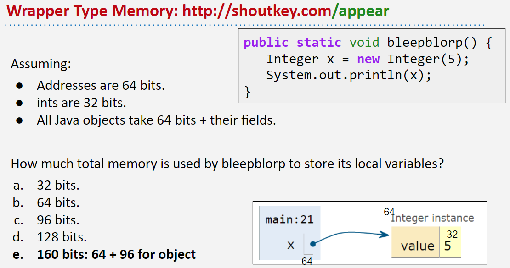
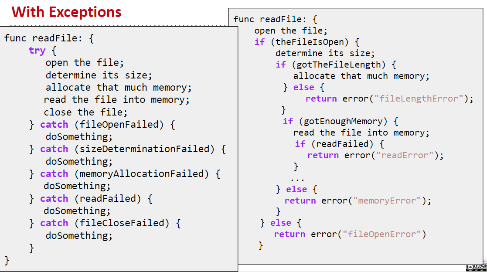
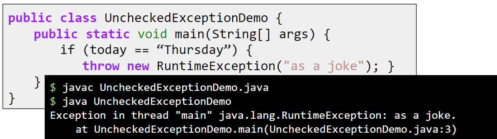
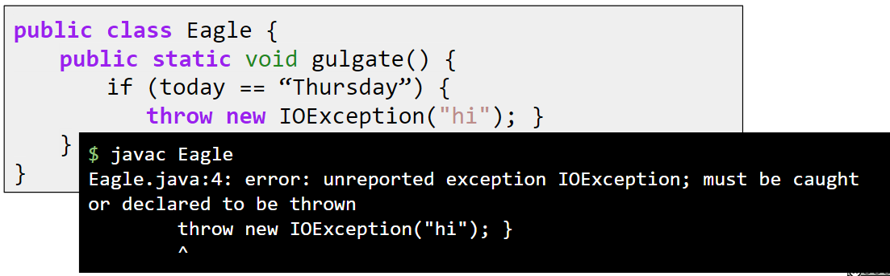
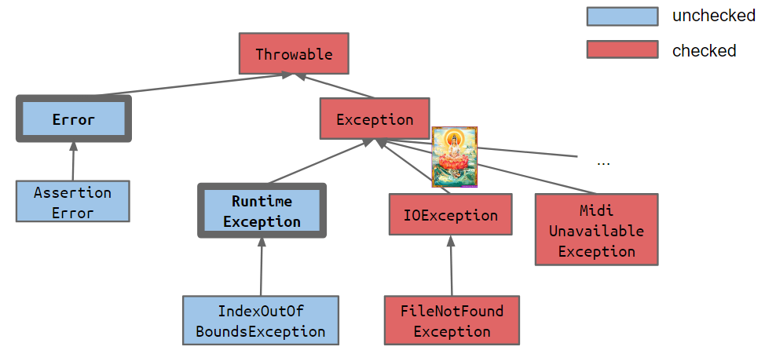
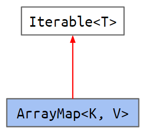
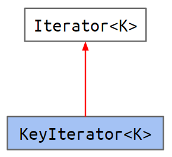

---
html:
    embed_local_images: true
    toc: true
toc:
    depth_from: 1
    depth_to: 2
    ordered: false
export_on_save:
    html: true
---

<!-- Importing styles for numbering sections from H1 -->
<!-- @import "C:\Users\aviat\.atom\mpe-styles\numbering-from-h1.less" -->
<!-- Importing fancy github-light theme -->
<!-- @import "C:/Users/aviat/.atom/mpe-styles/fancy-github-light.less" -->


# Week 5 - Lec.13 & Lec.14 {ignore=True .ignorenumbering}


## TOC {ignore=True .ignorenumbering}

<!-- @import "[TOC]" {cmd="toc" depthFrom=1 depthTo=2 orderedList=false} -->
<!-- code_chunk_output -->

* [Lec.13 - Conversion, Immutability, Generics](#lec13-conversion-immutability-generics)
	* [Conversion](#conversion)
	* [Immutability](#immutability)
	* [Generics (Again)](#generics-again)
* [Lec.14 - Exception, Iteration](#lec14-exception-iteration)
	* [Exception](#exception)
	* [Iterator](#iterator)

<!-- /code_chunk_output -->


# Lec.13 - Conversion, Immutability, Generics


## Conversion

### Reference Types and Generics {ignore=True .ignorenumbering}

Reminder: **Java has 8 primitive types, all other types are reference type**
- For each primitive type, there is corresponding reference type called wrapper class.
    * e.g. `boolean`'s wrapper class is `Boolean`
- To instantiate generic object, we have to use reference types:
```java
ArrayList<Integer> L = new ArrayList<Integer>();
```

But then why the code below works ?

> works
```java
L.add(5);
int first = L.get(0);
```

> why not below ?
```java
L.add(new Integer(5));
it first = L.get(0).valueOf();
```

### Autoboxing

**Autoboxing (Auto-unboxing)**: Implicit conversions between wrapper/primitives

Wrapper types and primitives can be used almost interchangeably:
- If Java code expects a wrapper type and gets a primitive, it is autoboxed
```java
L.add(5);
int first = L.get(0);
```
- If the code expects a primitive and gets a wrapper, it is unboxed
```java
public static void blahPrimitive(int x) {
    System.out.println(x);
}
public static void main(String[] args) {
    blahPrimitive(new Integer(20));
}
```

Notes:
- Arrays are never autoboxed/unboxed
    * e.g.: an `Integer[]` cannot be used in place of an `int[]` (or vice versa)
- Autoboxing / unboxing incurs a measurable performance impact !
- Wrapper types use MUCH more memory than primitive types

Quiz:


### Widening

**Widening**: Another type of conversion when moving from a primitive type with *a narrower range* to a primitive type with *a wider range*

- Code below is fine since `double` is wider than `int` (i.e. `int` can be *widened* to `double`)
```java
public static void blahDouble(double x) {
    System.out.println("double: " + x);
}
public static void main(String[] args) {
    int x = 20;
    blahDouble(x);
}
```

- To move from a wider type to a narrower type, we must use casting
```java
public static void blahInt(int x) {
    System.out.println("int: " + x);
}
public static void main(String[] args) {
    double x = 20;
    blahInt((int) x);
}
```


## Immutability

**Immutable data type**: An instance cannot change in any observable way after instantiation
- Mutable: `ArrayDeque`, `Planet`
- Immutable: `Integer`, `String`

Advantage: Less to think about: Avoids bugs and makes debugging easier
Disadvantage: Must create a new object anytime anything changes

##### immutability and `final` keyword {ignore=True .ignorenumbering}

The `final` keyword helps the compiler ensure immutability:
- `final` variable means we will assign a value once (either in constructor of class or in initializer)
- e.g.: `Date` class below is immutable

> Date.java
```java
public class Date {
    public final int month;
    public final int day;
    public final int year;
    private boolean contrived = true;
    public Date(int m, int d, int y) {
        month = m;
        day = d;
        year = y;
    }
}
```

- But not necessary to have `final` to be immutable
    * e.g.: `Date` class will also be immutable without `final` if all instance variables are `private`

**Warning**: Declaring a reference as `final` doesn't make object immutable
- e.g.: `public final Arraydeque<String> d = new ArrayDeque<>();`
- The `d` variable can never change, but still the referenced deque can change !


## Q. {ignore=True .ignorenumbering}

How to fix the code below with the following error ??
```java
@Test
public void test() {
    ArrayMap<Integer, Integer> am = new ArrayMap<>();
    am.put(2, 5);
    int expected = 5;
    assertEquals(expected, am.get(2));
}
```
```
ArrayMap.java:71: error: reference to assertEquals is ambiguous
        assertEquals(expected, am.get(2));
        ^
  both method assertEquals(long,long) in Assert and method assertEquals(Object,Object) in Assert match
```

### A.1: Call `assertEquals(long, long)` {ignore=True .ignorenumbering}

We should take 3 steps below in order to call `assertEquals(long, long)`
1. Widen `expected` to `long`
2. Unbox `am.get(2)` to `integer`
3. Widen the unboxed `am.get(2)` to `long`

### A.2: Call `assertEquals(Object, Object)` {ignore=True .ignorenumbering}

Only one conversion needed in order to call `assertEquals(Object, Object)` (unless we count `Integer` -> `Object`):
- Autobox `expected` into `Integer`

This can be done with casting:
```java
@Test
public void test() {
    ArrayMap<Integer, Integer> am = new ArrayMap<>();
    am.put(2, 5);
    int expected = 5;
    assertEquals((Integer) expected, am.get(2));
}
```


## Generics (Again)

### Generic Method {ignore=True .ignorenumbering}

We can create a method that *operates on generic types* by defining type parameters **before the return type of the method**
> e.g.: MapHelper.java
```java
/** Returns item in map if it exists. */
public static <K, V> V get(Map61B<K, V> map, K key) {
    if (map.containsKey(key)) {
        return map.get(key);
    } else {
        return null;
    }
}
```
- Note we can use generic types `K` and `V` in the signature and also in the method body itself.

Calling a generic method requires no special syntax:
```java
ArrayMap<Integer, String> ismap = new ArrayMap<Integer, String>();
System.out.println(MapHelper.get(ismap, 5));
```

### Type Upper Bounds

We can use `extends` keyword as a **type upper bound**. 
> e.g.: MapHelper.java
```java
/* Returns max of all keys. Works only if x and y have comparable data. */
public static <K, V> K maxKey(Map61B<K, V> map) {
    List<K> keyList = map.keys();
    K largest = keyList.get(0);
    for (K k : keyList) {        
        if (k.compareTo(largest) > 0) {
            largest = k;
        }
    }
    return largest;
}
```
- Meaning: Any `ArrayMap` we give to `maxKey` must have actual parameter type that is a subtype of `Comparable<T>`, i.e. `maxKey` is only allowed to be used on `ArrayMap`s with `Comparable` keys


# Lec.14 - Exception, Iteration


## Exception

Sometimes thing go wrong, e.g.:
- We try to cast a `Object` as a `Dog`, but dynamic type is not `Dog`
- We try to call a method using a reference variable that is equal to `null`
- We try to access index -1 of an array

The Java approach to handling these exceptions is to ***throw*** an ***exception***
- Disrupts normal flow of the program
- So far, we've seen just *implicit* exceptions
    * Java itself can throw exceptions implicitly: Crashes a program and prints a helpful (?) messages

### Explicit Exception: `throw`

We can throw our own exceptions using the `throw` keyword
- Can provide more informative message to the users
- Can provide more information to some sort of error handling code

> e.g.: ArrayMap.java
```java
public V get(K key) {
    int index = keyIndex(key);
    if (index < 0) {
        throw new IllegalArgumentException("Key " + key + " does not exist in map.")
    }
    return values[index];
}
```


### `try` & `catch`

We can *catch* exceptions preventing program from crashing: Use keywords `try` and `catch` to break normal flow

`catch` blocks can execute arbitrary code:
- Can include corrective action

```java
try {
    readFile(fileName);
} catch (Exception e) {
    retryReadFile(fileName);
}
```

### Why Exceptions ?

*{++Allows us to keep error handling code separate from real code++}*



### Checked vs. Unchecked Exception

> `error: unreported exception IOException; must be caught or declared to be thrown`

Code sometimes won't even compile with the error message above:
- Basic idea: Some exceptions are considered so disgusting by the compiler that we MUST handle them somehow
- We call these **checked** exceptions
    * *Must be checked exceptions* is a more accurate name

#### Unchecked Exception

The exceptions we have seen so far are all **unchecked** exceptions.
Unchecked exceptions can be compiled: Code below will compile (but will crash at runtime)




#### Checked Exception

By contrast, compiler requires all **checked** exceptions to be *caught* or *specified*: Disallow compilation to prevent avoidable program crashes



##### Two Ways to Satisfy Compiler {ignore=True .ignorenumbering}

1. **{++Catch++}**: Use a `catch` block after potential exception
```java
public static void gulgate() {
    try {
        if (today == "Thursday") {
            throw new IOException("hi");
        }
    } catch (Exception e) {
        System.out.println("psych !");
    }
}
```

2. **{++Specify++}** method as dangerous with `throws` keyword
```java
public static void gulgate() throws IOException {
    if (today == "Thursday") {
        throw new IOException("hi");
    }
}
```

###### Chain of Danger {ignore=True .ignorenumbering}
If a method uses a *dangerous* method (i.e. might throw a checked exception), *it becomes dangerous itself*.

> He who fights with monsters should look to it that he himself does not become a monster. And when you gaze long into an abyss the abyss also gazes into you. 
> > *"Beyond Good and Evil"*, Friedrich Nietzsche

Here again, we have two ways to satisfy compiler: {++Catch++} or {++Specify++} exception

- 2.1. **{++Catch++}**: *Use when we can handle the problem*
```java
public static void main(String[] args) {
    try {
        gulgate();
    } catch (IOException e) {
        System.out.println("Averted !");
    }
}
```

- 2.2. **{++Specify++}**: *Use when someone else should handle*
```java
public static void main(String[] args) throws IOException {
    gulgate();
}
```

#### Checked vs. Unchecked

Any subclass of `RuntimeException` or `Error` is *{++unchecked++}*, all the other `Throwable`s are *{++checked++}*



##### Q.: Why Not All Checked ? {ignore=True .ignorenumbering}

A.: Unchecked exceptions are unpredictable in advance and there is nothing we can do, but checked exceptions are exceptions for which a remedy conceivably exists !


## Iterator

### Enhanced For Loop

The two code block below are equivalent:
```java
List<Integer> il = new ArrayList<>();
...
for (int x : il) {
    System.out.println(x);
}
```
```java
List<Integer> il = new ArrayList<>();
...
Iterator<Integer> ili = il.iterator();
while (ili.hasNext()) {
    System.out.println(ili.next());
}
```

For code on the right to work:
1. `List` interface has a method called `iterator()` that returns an `Iterator<T>`
2. `Iterator` interface has `hasNext()` and `next()` methods

### `Iterable` Interface

`List` interface has a method called `iterator()` that returns an `Iterator<T>`:
- **HOW**: The `List` interface extends the `Iterable` interface, inheriting the abstract `iterator` method

> Iterable.java
```java
public interface Iterable<T> {
    Iterator<T> iterator();
}
```
> List.java
```java
public interface List<T> extends Iterable<T> {
    ...
}
```

### `Iterator` Interface

`Iterator` interface has `hasNext()` and `next()` methods
- **HOW**: The `Iterator` interface specifies these abstract methods explicitly

> Iterator.java
```java
public interface Iterator<T> {
    boolean hasNext();
    T next();
}
```

### Implementation: Using A Nested Class

> ArrayMap.java
```java
...
import java.util.Iterator;

public class ArrayMap<K, V> implements Map61B<K, V>, Iterable<K> {
    ...
    
    private class KeyIterator implements Iterator<K> {

        int wizardPosition;

        KeyIterator() {
            wizardPosition = 0;
        }

        public boolean hasNext() {
            return wizardPosition < size;
        }

        public K next() {
            K returnVal = keys[wizardPosition];
            wizardPosition += 1;
            return returnVal;
        }

    }

    @Override
    public Iterator<K> iterator() {
        return new KeyIterator();
    }

}
```

```java
ArrayMap<String, Integer> am = new ArrayMap<String, Integer>();
...
for (String s : am) {
    System.out.println(s);
}
```

Notes:
1. There are two important `implements`s:

| `implements` 1                                                                    | `implements` 2                                                                          |
|-----------------------------------------------------------------------------------|-----------------------------------------------------------------------------------------|
| {>>img1<<} | {>>img2<<} |

2. `hasNext` and `next` methods should be `public` even inside `private` class
    - Otherwise causes error:
```
Error:(81, 11) java: next() in ArrayMap.KeyIterator cannot implement next() in java.util.Iterator
  attempting to assign weaker access privileges; was public
Error:(77, 17) java: hasNext() in ArrayMap.KeyIterator cannot implement hasNext() in java.util.Iterator
  attempting to assign weaker access privileges; was public
```