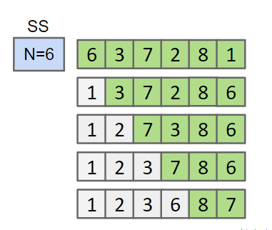
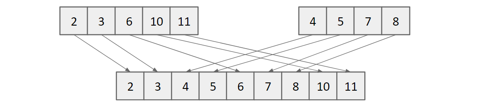

---
html:
    embed_local_images: true
    toc: true
toc:
    depth_from: 1
    depth_to: 2
    ordered: false
export_on_save:
    html: true
---

<!-- Importing styles for numbering sections from H1 -->
<!-- @import "C:\Users\aviat\.atom\mpe-styles\numbering-from-h1.less" -->
<!-- Importing fancy github-light theme -->
<!-- @import "C:/Users/aviat/.atom/mpe-styles/fancy-github-light.less" -->


# Week 7 - Lec.17 & Lec.18 & Lec.19 {ignore=True .ignorenumbering}


## TOC {ignore=True .ignorenumbering}

<!-- @import "[TOC]" {cmd="toc" depthFrom=1 depthTo=2 orderedList=false} -->
<!-- code_chunk_output -->

* [Lec.17 - Introduction to Asymptotic Analysis](#lec17-introduction-to-asymptotic-analysis)
	* [Runtime Characterization](#runtime-characterization)
	* [Intuitive Approach](#intuitive-approach)
	* [Worst Case & Order of Growth](#worst-case-order-of-growth)
	* [Simplified Analysis](#simplified-analysis)
	* [Big-Theta](#big-theta)
* [Lec.18 - Analysis of Algorithms](#lec18-analysis-of-algorithms)
	* [Strategies](#strategies)
	* [For Loops](#for-loops)
	* [Recursion](#recursion)
	* [Binary Search](#binary-search)
	* [Merge Sort](#merge-sort)
* [Lec.19 - Big O, Big Omega, Amortized Runtime](#lec19-big-o-big-omega-amortized-runtime)
	* [Big O](#big-o)
	* [Big Omega](#big-omega)
	* [Amortized Analysis](#amortized-analysis)

<!-- /code_chunk_output -->


# Lec.17 - Introduction to Asymptotic Analysis


## Runtime Characterization

We want to somehow {++characterize the runtimes++} of the functions below to check whether an *sorted* array includes duplicates.

> dup1
```java
boolean dup1(int[] A) {
    for (int i = 0; i < A.length; i += 1) {
        for (int j = i + 1; j < A.length; j += 1) {
            if (A[i] == A[j]) {
                return true;
            }
        }
    }
    return false;
}
```

> dup2
```java
boolean dup2(int[] A) {
    for (int i = 0; i < A.length - 1; i += 1) {
        if (A[i] == A[i + 1]) {
            return true;
        }
    }
    return false;
}
```

###### The characterization should: {ignore=True .ignorenumbering}
- {++Demonstrate superiority of one over another++}
- Be {++simple++} and {++mathematically rigorous++}


## Intuitive Approach

1. Actually simulate runtime: Use `time` or `Stopwatch` class by Princeton Standard Library
2. Count possible operations:

> `dup1`

| operation          | actual count (input size: $10,000$) | symbolic count              |
|--------------------|-------------------------------------|-----------------------------|
| `i = 0`            | $1$                                 | $1$                         |
| `j = i + 1`        | $1$ to $10,000$                     | $1$ to $N$                  |
| less that (`<`)    | $2$ to $50,015,001$                 | $2$ to $(N^2 + 3N + 2) / 2$ |
| increment (`+= 1`) | $0$ to 50,005,000                   | $0$ to $(N^2 + N) / 2$      |
| equals (`==`)      | $1$ to $49,995,000$                 | $1$ to $(N^2 - N) /2$       |
| array access       | $2$ to $99,990,000$                 | $2$ to $N^2 - N$            |

> `dup2`

| operation          | actual count (input size: $10,000$) | symbolic count  |
|--------------------|-------------------------------------|-----------------|
| `i = 0`            | $1$                                 | $1$             |
| less than (`<`)    | $0$ to $10,000$                     | $0$ to $N$      |
| increment (`+= 1`) | $0$ to $9,999$                      | $0$ to $N -1$   |
| equals (`==`)      | $1$ to $9,999$                      | $1$ to $N - 1$  |
| array access       | $2$ to $19,998$                     | $2$ to $2N - 2$ |

### Comparing Algorithms {ignore=True .ignorenumbering}

From tables above, we can say `dup2` is better:
- Needs fewer operations to do the same work: $50,015,001$ vs. $10,000$
- **{++Scales++}** better in the worst case: $(N^2 + 3N + 2)$ vs. $N$

### Asymptotic Behavior {ignore=True .ignorenumbering}

In most cases, we care only about {++asymptotic behavior, i.e. what happens for very large input size++}. e.g.:
- Simulation of billions of interacting particles
- Social network with billions of users
- Logging of billions of transactions
- Encoding of billions of bytes of video date

Algorithms which {++scale++} well (e.g. look like lines) have better asymptotic runtime behavior than algorithms that scale relatively poorly (e.g. look like parabolas).

#### e.g.: Parabolas vs. Lines {ignore=True .ignorenumbering}


## Worst Case & Order of Growth

###### Again: The characterization should: {ignore=True .ignorenumbering}
- {++Demonstrate superiority of one over another++}
- **Be {++simple++} and {++mathematically rigorous++}**

Let's do some simplifications:

##### 1. Only consider the worst case {ignore=True .ignorenumbering}

When comparing algorithms, we often care only about the worst case (of course there are exceptions)

| operation          | worst case count     |
|--------------------|----------------------|
| `i = 0`            | $1$                  |
| `j = i + 1`        | $N$                  |
| less that (`<`)    | $(N^2 + 3N + 2) / 2$ |
| increment (`+= 1`) | $(N^2 + N) / 2$      |
| equals (`==`)      | $(N^2 - N) /2$       |
| array access       | $N^2 - N$            |

##### 2. Pick the cost model {ignore=True .ignorenumbering}

Pick some representative operation to act as a proxy for the overall runtime:
- Good choice: Either of increment, less than, equals or array access
- Bad choice: `i = 0`, `j = i + 1`

We call our choice the ***cost model***

| operation          | worst case count |
|--------------------|------------------|
| increment (`+= 1`) | $(N^2 + N) / 2$  |

##### 3. Ignore lower order terms  {ignore=True .ignorenumbering}

| operation          | worst case count |
|--------------------|------------------|
| increment (`+= 1`) | $N^2 / 2$        |

##### 4. Ignore multiplicative constants {ignore=True .ignorenumbering}

It has not real meaning: We already threw away information when we choose a single proxy operation

| operation          | worst case count |
|--------------------|------------------|
| increment (`+= 1`) | $N^2$            |

### Simplification Summary

4 Simplifications:
1. Only consider the worst case
2. Pick a representative operation (a.k.a. the cost model)
3. Ignore lower order terms
4. Ignore multiplicative constants

2 ~ 4 should be OK because we only care about the *order of growth* of the runtime (a.k.a. scalability)


## Simplified Analysis

Rather than building the entire table, we can instead:
- Choose a representative operation to count (a.k.a. cost model)
- Figure out the order of growth for the count of it by either:
    1. Making an exact count
    2. Simpler geometric argument

### e.g.: Simplified `dup1` analysis {ignore=True .ignorenumbering}

> 1. Maing an exact count


> 2. Simpler geometric argument


## Big-Theta

Suppose we have a function $R(N)$ with order of growth $f(N)$.

In *Big-Theta* notation we write this as $R(N) \in \Theta(f(N))$:
- e.g.1: $N^3 + 3N^4 \in \Theta(N^4)$ 
- e.g.2: $40 \sin(N) + 4N^2 \in \Theta(N^2)$

Here $ R(N) \in \Theta(f(N)) $ means there exist positive constants $k_1$ and $k_2$ such that:
$$
    k_1 \cdot f(N) \leq R(N) \leq k_2 \cdot f(N)
$$
for all values of $N$ greater than some $N_0$ (i.e. very large $N$)

We can use $\Theta$ notation anywhere we refer to order of growth:

| operation          | worst case count |
|--------------------|------------------|
| increment (`+= 1`) | $\Theta(N^2)$    |


# Lec.18 - Analysis of Algorithms


## Strategies

**{++There is no magic shortcut for analysis of algorithms++}**:
- Runtime analysis often requires careful thought
- We should know 2 kinds of sum:
    * $1 + 2 + 3 + ... + N = \sum_{n = 1}^{N} n = \frac{N(N + 1)}{2} = \Theta(N^2)$
    * $1 + 2 + 4 + ... + 2^{N - 1} = \sum_{n = 0}^{N - 1} 2^n = 2^N - 1 = \Theta(2^N)$
- Strategies:
    * Find exact sum
    * Write out examples
    * Geometrical approach


## For Loops

```java
void printParty(int N) {
    for (int i = 1; i <= N; i = i * 2) {
        for (int j = 0; j < i; j += 1) {
            System.out.println("Hello !");
        }
    }
}
```

Cost model $C(N)$: `println("Hello !")` calls

- Write out examples

| $N$     | $1$   | $2$ | $3$   | $4$ | $5$   | $6$  | $7$   | $8$  | $9$  |
|---------|-------|-----|-------|-----|-------|------|-------|------|------|
| $C(N)$  | $1$   | $3$ | $3$   | $7$ | $7$   | $7$  | $7$   | $15$ | $15$ |
| $0.5 N$ | $0.5$ | $1$ | $1.5$ | $2$ | $2.5$ | $3$  | $3.5$ | $4$  | $5$  |
| $2N$    | $2$   | $4$ | $6$   | $8$ | $10$  | $12$ | $14$  | $16$ | $18$ |

$R(N) = \Theta(1 + 2 + 4 + ... + N) = \Theta(N)$


## Recursion

```java
int f3(int n) {
    if (n <= 1) {
        return 1;
    }
    return f3(n - 1) + f3(n - 1);
}
```

- Find exact sum: $C(N) = 1 + 2 + 4 + ... + 2^{N - 1} = 2^N - 1$
- *Recurrence relation*: $C(N) = 2C(N - 1) + 1$

Since work during each call is constant: $R(N) = \Theta(2^N)$


## Binary Search

```java
int binarySearch(String[] sorts, string x, int lo, int hi) {
    if (lo > hi) {
        return -1;
    }
    
    int m = (lo + hi) / 2;
    int cmp = x.compareTo(sorted[m]);
    if (cmp < 0) {
        return  binarySearch(sorted, x, lo, m -1);
    } else if (cmp > 0) {
        return binarySearch(sorted, x, m + 1, hi);
    } else {
        return m;
    }
}
```

Cost model $C(N)$: The number of calls to `binarySearch`

Problem size halves over and over until it gets down to 1:
$$
    1 = \frac{N}{2^{C(N)}} \Leftrightarrow C(N) = \log_2(N)
$$

### Exact Count {ignore=True .ignorenumbering}

Cost model $C(N)$: The number of calls to `binarySearch`

| $N$    | $1$ | $2$ | $3$ | $4$ | $5$ | $6$ | $7$ | $8$ | $9$ | $10$ | $11$ | $12$ | $13$ |
|--------|-----|-----|-----|-----|-----|-----|-----|-----|-----|------|------|------|------|
| $C(N)$ | $1$ | $2$ | $2$ | $3$ | $3$ | $3$ | $3$ | $4$ | $4$ | $4$  | $4$  | $4$  | $4$  |

- $C(N) = \lfloor \log_{2}(N) \rfloor + 1$
- Since each call takes constant time, $R(N) = \Theta(\lfloor \log_{2}(N) \rfloor)$

## Handy Big Theta Properties {ignore=True .ignorenumbering}

- $\lfloor f(N) \rfloor = \Theta(f(N))$: The floor of $f$ has same order of growth as $f$
- $\lfloor f(N) \rfloor = \Theta(f(N))$: The ceiling of $f$ has same order of growth as $f$
- $\log_{P}(N) = \Theta(\log_{Q}(N))$: Logarithm base does not affect order of growth

### Exact Count: Again {ignore=True .ignorenumbering}

We can simplify the original $\Theta(\lfloor \log_{2}(N) \rfloor)$ as:
$$
    R(N) = \Theta(\log N)
$$

### Log Time Is Really Terribly Fast {ignore=True .ignorenumbering}

In practice, logarithmic time algorithm have almost constant runtimes.
- Even for incredibly huge datasets, practically equivalent to constant time

| $N$                   | $\log N$ | Typical runtime (seconds) |
|-----------------------|----------|---------------------------|
| $100$                 | $6.6$    | $1$ nanoseconds           |
| $100,000$             | $16.6$   | $2.5$ nanoseconds         |
| $100,000,000$         | $26.5$   | $4$ nanoseconds           |
| $100,000,000,000$     | $36.5$   | $5.5$ nanoseconds         |
| $100,000,000,000,000$ | $46.5$   | $7$ nanoseconds           |


## Merge Sort

### Selection Sort

- Find the smallest unfixed item, move it to the front, and *fix* it
- Sort the remaining unfixed items using selection sort

| Operation                                      | Runtime       |
|------------------------------------------------|---------------|
|  | $\Theta(N^2)$ |

### Merge Operation

{++Given two sorted arrays++}, the merge operation combines them into a single sorted array by successively copying the smallest item from the two arrays into a target array

| Operation  ([demo](https://docs.google.com/presentation/d/1mdCppuWQfKG5JUBHAMHPgbSv326JtCi5mvjH1-6XcMw/edit#slide=id.g463de7561_042)) | Runtime     |
|---------------------------------------------------------------------------------------------------------------------------------------|-------------|
|                                                                                        | $\Theta(N)$ |

### Selection Sort & Merge Operation

Merging can give us an improvement over vanilla selection sort: e.g.: $N = 64$
- Only: $64^2 = 4096$ AU (arbitrary units)
- Combined:  $2112$ AU
    - Selection sort of the left half: $\Theta(N^2)$: $32^2 = 1024$ AU
    - Selection sort of the left right: $\Theta(N^2)$: $32^2 = 1024$ AU
    - Merge the results: $\Theta(N)$: $64$ AU

Can even do better by adding a second layer of merges:
- Only: $4096$ AU
- One layer merge: $2112$ AU
- Two layer merges: $1152$ AU
    * Merge operation: $64 + 2 \times 32 = 128$ AU
    * Selection sort: $4 \times 16^2 = 1024$ AU

And so on.

### Mergesort

Mergesort does merges all the way down (no selection sort):
- Total runtime to merge all the way down: $384$ AU
    * Top layer: $64$ AU
    * Second layer: $32 \times 2 = 64$ AU
    * Third layer: $16 \times 2 = 4$ AU
    * ... (For all $\log_2(64) = 6$ layers)

Back to $N$ notation:
- Every lever takes $\Theta(N)$
- The number of layer $\log_2 (N)$
- Overall runtime can be summarized: $\Theta(N \log N)$

$N \log N$ is basically as good as $N$, and is vastly better than $N^2$ !!


# Lec.19 - Big O, Big Omega, Amortized Runtime


## Big O

Whereas Big Theta can informally be thought of as something like *equals*, Big O can be thought of as *less than or equal*:
- $N^3 + 3N^4 \in \Theta(N^4)$
- $N^3 + 3N^4 \in O(N^4)$
- $N^3 + 3N^4 \in O(N!)$

$R(N) \in O(f(N))$ means there exists positive constants $k_2$ such that:
$$
    R(N) \leq k_2 \cdot f(N)
$$
for all values of $N$ greater than some $N_0$ (i.e. very large $N$)

### Big Theta vs. Big O

Big Theta only expresses exact order of growth for runtime in terms of $N$
- If runtime depends on more factors than just $N$, may need different Big Theta for every interesting condition
- e.g.: The best case runtime of $f$ is $\Theta(1)$, whereas the worst one is $\Theta(N^2)$

We can just use Big O instead and avoid qualifying our statement at all:
- The runtime of $f$ is $O(N^2)$

### Big O Abuse

In the real world, Big O is often used where Big Theta would be more informative, e.g. saying "Mergesort is $O(N \log N)$"
- True statement, but not as strong as saying "Mergesort is $\Theta(N \log N)$"

Despite lower precision, Big O is used way more often in conversation:
- **{++Important++}**: Big O does not mean *worst case* ! Often abused to mean this.

### The Usefulness of Big O

Big O is still an useful idea:
- Allows us simpler statement
    * e.g.: "Binary search is $O(\log N)$" instead of "Binary search is $\Theta(\log N)$ in the worst case"
- Sometimes don't know the exact runtime, so use $O$ to give an upper bound
- Easier to write proofs for Big O than Big Theta
    * e.g.: Finding runtime of Mergesort, we can round up the number of input items to the next power of 2


## Big Omega

Big Omega can be thought of as *greater than or equal*:

$R(N) \in \Omega(f(N))$ means there exists positive constants $k_1$ such that:
$$
    k_1 \cdot f(N) \leq R(N)
$$
for all values of $N$ greater than some $N_0$ (i.e. very large $N$)

### Why Big Omega ?

Two common uses:
- Very careful proofs of Big Theta runtime
    * If $R(N) = O(f(N))$ and $R(N) = \Omega(f(N))$, then $R(N) = \Theta(f(N)$
    * Sometimes it's easier to show $O$ and $\Omega$ separately
- Providing lower bounds for the hardness of a problem
    * e.g.: The time to find whether an array has duplicates is $\Omega(N)$ in the worst case for ANY algorithm (have to actually look at everything)

## Big Theta, Big O, and Big Omega {ignore=True .ignorenumbering}

|                          | Informal meaning                                   | Family        | Family members             |
|--------------------------|----------------------------------------------------|---------------|----------------------------|
| Big Theta $\Theta(f(N))$ | Order of growth is $f(N)$                          | $\Theta(N^2)$ | $N^2/2$, $2N^2$, $N^2 + N$ |
| Big O $O(f(N))$          | Order of growth is less than or equal to $f(N)$    | $O(N^2)$      | $N^2/2$, $2N^2$, $\log N$  |
| Big Omega $\Omega(f(N))$ | Order of growth is greater than or equal to $f(N)$ | $\Omega(N^2)$ | $N^2/2$, $2N^2$, $e^N$     |


## Amortized Analysis

### e.g.: Geometric Resizing {ignore=True .ignorenumbering}

Why geometric resizing within `ArrayList`'s `add()` method is much faster ?

- Pick a cost model: Array access (read & write)
- Compute the {++amortized++} (a.k.a. average) cost of the ith insertion
- Show that this cost is bounded above by a constant

> Example amorization (starting from size 1)

| `add(item)`                       | 0 | 1 | 2 | 3  | 4  | 5  | 6  | 7  | 8  | 9  | 10 | 11 | 12 |
|-----------------------------------|---|---|---|----|----|----|----|----|----|----|----|----|----|
| `a[i] = item`  write cost         | 1 | 1 | 1 | 1  | 1  | 1  | 1  | 1  | 1  | 1  | 1  | 1  | 1  |
| `resize` copy (read & write) cost | 0 | 2 | 4 | 0  | 8  | 0  | 0  | 0  | 16 | 0  | 0  | 0  | 0  |
| total cost                        | 1 | 3 | 5 | 1  | 9  | 1  | 1  | 1  | 17 | 1  | 1  | 1  | 1  |
| cumulative cost                   | 1 | 4 | 9 | 10 | 19 | 20 | 21 | 22 | 39 | 40 | 41 | 42 | 43 |

- *Amortized* total cost seems to be about $43 / 12 = 3.58$ accesses / `add`
- How do we prove that this amortized cost is constant ?

### Potential

**{++Key idea++}**: Choosing $a_i$ so that $\Phi_i$ stays positive

For operation $i$, choose an arbitrary *amortized cost* $a_i$. This cost may be more or less than the *actual cost* $c_i$ of that operation
- Let $\Phi_i$ be the potential at time $i$
    * The potential represents the cumulative difference between arbitrary amortized costs and actual costs over time
    * $\Phi_{i + 1} = \Phi_i + (a_i - c_i)$
- If we select $a_i$ such that $\Phi_i$ is never negative, then amortized cost is an upper bound on actual cost


| `add(item)`          | 0 | 1 | 2 | 3  | 4  | 5  | 6  | 7  | 8   | 9  | 10 | 11 | 12 |
|----------------------|---|---|---|----|----|----|----|----|-----|----|----|----|----|
| amortized cost $a_i$ | 5 | 5 | 5 | 5  | 5  | 5  | 5  | 5  | 5   | 5  | 5  | 5  | 5  |
| total cost    $c_i$  | 1 | 3 | 5 | 1  | 9  | 1  | 1  | 1  | 17  | 1  | 1  | 1  | 1  |
| change in potential  | 4 | 2 | 0 | 4  | -4 | 4  | 4  | 4  | -12 | 4  | 4  | 4  | 4  |
| potential $\Phi_i$   | 4 | 6 | 6 | 10 | 6  | 10 | 14 | 18 | 6   | 10 | 14 | 18 | 22 |

Goals for `ArrayList`: $a_i \in \Theta(1)$ and $\Phi_i \geq 0 $ for all $i$
- Cost for operations is $1$ for non-powers of 2, and $2i + 1$ for powers of 2
- For high cost ops, we need $2i + 1$ in the bank: Have previous $i / 2$ ops to reach this balance
