---
html:
    embed_local_images: true
    toc: true
toc:
    depth_from: 1
    depth_to: 2
    ordered: false
export_on_save:
    html: true
---

<!-- Importing styles for numbering sections from H1 -->
<!-- @import "C:\Users\aviat\.atom\mpe-styles\numbering-from-h1.less" -->
<!-- Importing fancy Github-Light theme -->
<!-- @import "C:/Users/aviat/.atom/mpe-styles/fancy-github-light.less" -->


# Week 8 - Lec.20 & Lec.21 & Lec.22 {ignore=True .ignorenumbering}


## TOC {ignore=True .ignorenumbering}

<!-- @import "[TOC]" {cmd="toc" depthFrom=1 depthTo=2 orderedList=false} -->
<!-- code_chunk_output -->

* [Lec.20 - Disjoint Sets](#lec20-disjoint-sets)
    * [Disjoint Set ADT](#disjoint-set-adt)
    * [`QuickFindDS`](#quickfindds)
    * [`QuickUnionDS`](#quickunionds)
    * [`WeightedQuickUnionDS`](#weightedquickunionds)
    * [Performance Summary](#performance-summary)
    * [Appendix - `WeightedQuickUnionDSWithPathCompression`](#appendix-weightedquickuniondswithpathcompression)
* [Lec.21 - Binary Search Tree](#lec21-binary-search-tree)
    * [BST Definition](#bst-definition)
    * [BST Operations](#bst-operations)
    * [BST Performance](#bst-performance)
    * [Summary](#summary)
* [Lec.22 - Balanced Search Tree](#lec22-balanced-search-tree)
    * [Tree Rotation](#tree-rotation)
    * [B-Tree](#b-tree)
    * [Red-Black Tree](#red-black-tree)
    * [Summary](#summary-1)

<!-- /code_chunk_output -->


# Lec.20 - Disjoint Sets


## Dynamic Connectivity Problem {ignore=True .ignorenumbering}

Given a series of pairwise items connectedness declarations, determine if two items are connected. Two operations:
- `connect(p, q)`: Connect items `p` and `q`
- `isConnected(p, q)`: Are `p` and `q` connected ?


## Disjoint Set ADT

@import "../lectureCode-sp18/disJointSet/src/DisJointSet.java"

- Number of elements $N$ can be huge
- Number of method calls $M$ can be huge
- Can't assume that we stop getting `connect` calls after some point

### Implementation Approaches {ignore=True .ignorenumbering}

- Naïve approach: Record every single connecting line somehow
    * 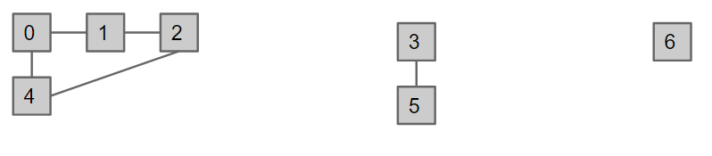
- Better approach: Model connectedness in terms of **set**s
    * How things are connected isn't something we need to know
    * 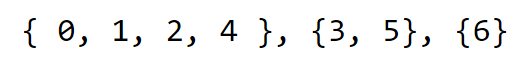

## `QuickFindDS`

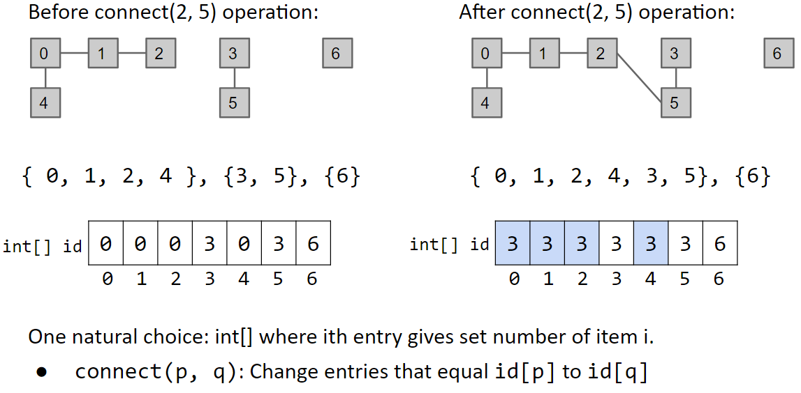

@import "../lectureCode-sp18/disJointSet/src/QuickFindDS.java"

### Performance Issue {ignore=True .ignorenumbering}

Calling `connect` takes **$\Theta(N)$** and can be slow !


## `QuickUnionDS`

How can we speed `connect` ?
- Idea: Assign each node a parent (instead of an id)

@import "../lectureCode-sp18/disJointSet/src/QuickUnionDS.java"

### Performance Issue {ignore=True .ignorenumbering}

Tree can get too tall !

| operation                                                                      | connected component                                                          |
|--------------------------------------------------------------------------------|------------------------------------------------------------------------------|
| `connect(4, 3)` <br> `connect(3, 2)` <br> `connect(2, 1)` <br> `connect(1, 0)` | {>>img<<}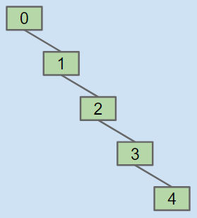 |

Results in potentially even worse performance than `QuickFindDS` if tree is imbalanced


## `WeightedQuickUnionDS`

Modify `QuickUnionDS` to avoid tall trees:
- Track tree *size* (*number* of elements)
- New rule: ***Always link root of smaller tree to larger tree***

@import "../lectureCode-sp18/disJointSet/src/WeightedQuickUnionDS.java"

### Performance {ignore=True .ignorenumbering}

Max depth of any item: $\log N$
- Depth of an element `x` increases only when tree `T1` that contains `x` get linked below some other tree `T2`'s parent
    * The size of the tree at least doubles since `size(T2)` $\geq$ `size(T1)`
    * Tree containing `x` doubles *at most* $\log N$ times (i.e. Depth increases $\log N$ times)


## Performance Summary

| Implementation         | Constructor | `connect`   | `isConnected` |
|------------------------|-------------|-------------|---------------|
| `QuickFindDS`          | $\Theta(N)$ | $\Theta(N)$ | $\Theta(1)$   |
| `QuickUnionDS`         | $\Theta(N)$ | $O(N)$      | $O(N)$        |
| `WeightedQuickUnionDS` | $\Theta(N)$ | $O(\log N)$ | $O(\log N)$   |

Running $M$ operations on a `DisJointSet` object with $N$ elements
- Runtimes goes from $O(MN)$ to $O(N + M \log N)$
- For $N = 10^9$ and $M = 10^9$, time to run goes *from 30 years to 6 seconds*
    * Good data structure unlocks solutions to problems that could otherwise not be solved !


## Appendix - `WeightedQuickUnionDSWithPathCompression`

Below is the topology of the worst case if we use `WeightedQuickUnionDS`
- Clever idea: When we do `isConnected(15, 10)`, tie all nodes seen to the root
    * Additional cost is insignificant (same order of growth)

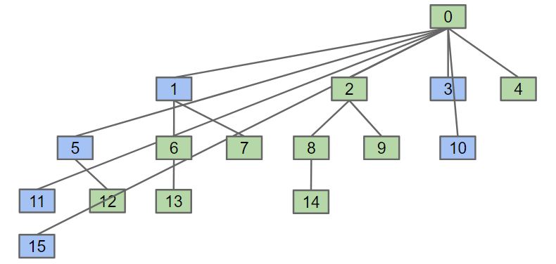

Path compression results in a `connect` / `isConnected` operations that are very close to amortized constant time
- $M$ operations on $N$ nodes is $O(N + M \lg^* N)$
    * $\lg^*$ is less than $5$ for any realistic input
- A tighter bound: $O(N + M \alpha(N))$, where $\alpha$ is the inverse Ackermann function
    * $\alpha$ is less than $5$ for all practical input !

@import "../lectureCode-sp18/disJointSet/src/WeightedQuickUnionDSWithPathCompression.java"


# Lec.21 - Binary Search Tree

With ***order linked list map*** [implementation](../lectureCode-sp18/exercises/DIY/syntax1/ArrayMap.java), search is slow, let's speed up with tree data structure !


## BST Definition

### Tree

A **{++tree++}** consists of:
- A set of {++nodes++}
- A set of {++edges++} that connect those nodes
    * Constraint: There is exactly one path between any two nodes

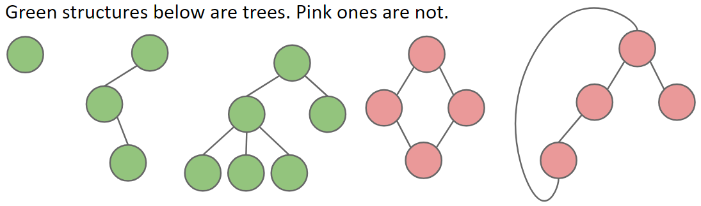

### Rooted (Binary) Trees

A **{++rooted tree++}** contains one node called the {++root++}:
- Every node except the root has exactly one parent, defined as the first node on the path from the node to the root
- A node with no child is called a {++leaf++}

A **{++rooted binary tree++}**, every node has *either 0, 1, or 2 children (subtrees)* 

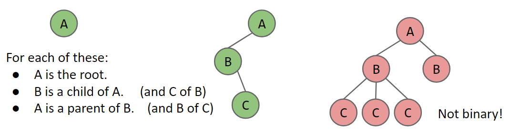

### Binary Search Tree

A **{++binary search tree++}** is a rooted binary tree with the BST property:
- **BST Property**: 
    * Given a node `X` in the tree:
        + Every key in the *left* subtree is *less* than `X`'s key
        + Every key in the *right* subtree is *greater* than `X`'s key
    * Ordering must be complete, transitive, and antisymmetric. Given keys `p` and `q`:
        + Exactly one of `p < q` and `q < p` are true
        + `p < q` and `q < r` imply `p < r`
    * *One consequence of these rules: No duplicate keys allowed !*

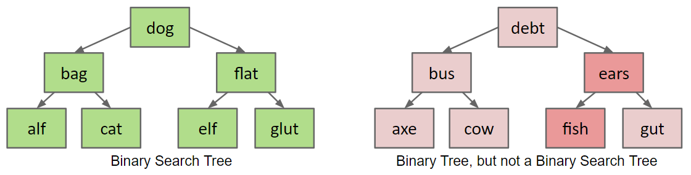


## BST Operations

### Search

```java
static BST search(BST tree, Key searchKey) { ... }
```

If `searchKey` equals `label` return:
- If `searchKey < label`, search left tree
- If `searchKey > label`, search right tree

The worst case runtime for "bushy" BST: $\Theta(\log N)$
($N$ is the number of nodes in tree)

### Insert

```java
static BST insert(BST tree, Key insertKey) {
    if (T == null)
        return new BST(insertKey);
    if (insertKey < T.label())
        T.left = insert(T.left, insertKey);
    else if (insertKey > T.label())
        T.right = insert(T.right, insertKey);
    return T;
}
```

### Delete

3 cases:
1. Deletion key has no children
2. Deletion key has one child
3. Deletion key has two children

Case 1, 2 are easy and all we need to do is just to manipulate references
- Then the garbage collector cleans discarded variables

#### Case 3 {ignore=True .ignorenumbering}

| Example: delete `"dog"` | |
|---|---|
| Goal: <br> - Find a new root node <br> - Must be larger than everything in the left subtree <br> - Must be smaller than everything in the right subtree | {>>Image<<}  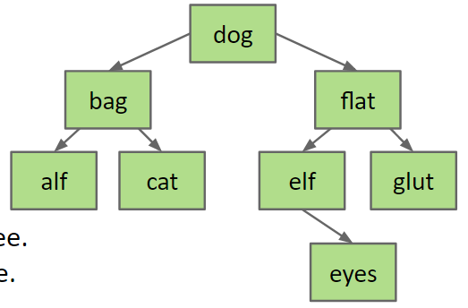 |

Would `bag` work ?: No !!

Choose either `cat` or `elf`:
- Delete `cat` or `elf`, and stick new copy in the root position
    * This deletion guaranteed to be either case 0 or 2:
        + Because they are always the biggest node in the left or the smallest node in the right

This deletion operation is called Hibbard deletion.


## BST Performance

Height varies dramatically between "bushy" and "spindly" trees:
- Height of "bushy": $\Theta(\log N)$
- height of "spindly": $\Theta(N)$

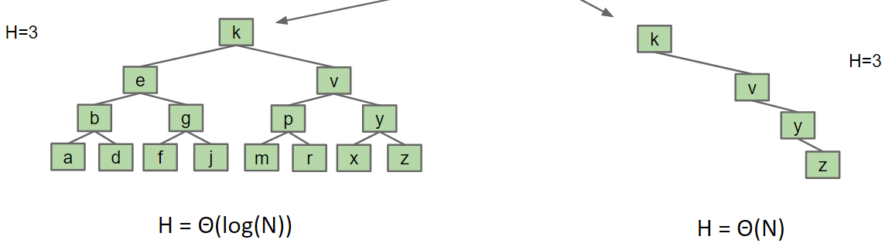

### Random Insertion

**Nice property**: Random insertions take on average only $\Theta(\log N)$ each

**Comparison counting**: If $N$ distinct keys are inserted into a BST, the expected average number of compares per insert is $C(N) \sim 2 \ln N = \Theta(\log N)$

**Tree height**: If $N$ distinct keys are inserted in random order, expected tree height is $H(N) \sim 4.311 \ln N$

### Random Deletion

**Surprising Fact**: Tree will get imbalanced !: $C(N) \sim \sqrt{N}$ per operation
(Finding a simple and efficient delete operation for BSTs is still an open problem)


## Summary

Binary search tree: Efficient data structures for supporting insertion and search
- Operations on "bushy" BSTs are logarithmic time
- Insertion of random data yields a bushy BST
    * On random data, order of growth for get/put operations is logarithmic

Performance issues:
- "Spindly" trees have linear performance
- Hibbard deletion results in order of growth $\sqrt{N}$
    * Nobody knows how to do better on simple BSTs


# Lec.22 - Balanced Search Tree

###### The trouble with BST {ignore=True .ignorenumbering}

BST have potential performance issue if it get "spindly" (too tall)
- Worst case: Items inserted in order

One solution:
- Insert in random order: Results in $\Theta(\log N)$ height with extremely high probability
- *But might not have all the data up front*


## Tree Rotation

Suppose we have a search tree as shown below:
- `RotateLeft(G)`: `G` moves left, **promote its right child `P`**
    * "Promote `P`" means `P` is the new parent of `G`
- To reverse the operation: `RotateRight(P)`
- Semantics of the tree are completely unchanged !

| Original | Rotated |
|---|---|
| {>>Image<<}<image src="../assets/week8/rotate-tree-1.png"> | {>>Image<<}<image src="../assets/week8/rotate-tree-2.png"> |

- Can shorten (or lengthen) a tree
- Preserves search tree property

One way to achieve balance:
- Rotate after each insertion and deletion to *maintain* balance
- BUT the mystery is to know *which* rotation: => [Red-Black Tree](#red-black-tree)


## B-Tree

### Search Trees

There are many types of search trees:
- **Binary Search Tree**: Require rotations to maintain balance. There are many strategies for rotation:
    * AVL, weight-balancing, **Red-Black**
- Treap
- Splay Tree
- **B-Trees (e.g.: 2-3 / 2-3-4 Tree)**: No rotation required

###### Why B-Tree ?
Intriguingly, a deep understanding of B-Tree also provides a rotation strategy for BST called **Red-Black**

### Road to Splitting Tree (A.K.A. B-Tree)

#### Overstuff Nodes

The problem is adding new leaves:
- Solution 1: Overstuff the leaf nodes !
    * "Overstuffed" tree always has balanced height, because leaf depths never change: Height is just max depth

**New problem**: Leaf nodes can get too juicy
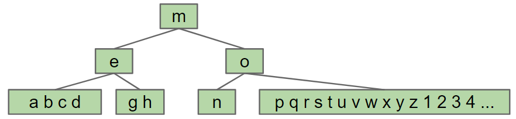

#### Cap Nodes

Set a cap on the number of items, say 3:
- If more than cap, *give an item to parent*
    * Which one ?: Whatever, let's say the left-middle

| Juicy | Capped |
|---|---|
| {>>Image<<}<image src="../assets/week8/juicy-tree.png"> | {>>Image<<}<image src="../assets/week8/capped-tree.png"> |

**New problem**: Item between `o` and `q` have no home

#### Split Nodes

If more than cap, give an item to parent:
- Pulling item out of juicy node, **splits** it into left and right
- Parent node now has three children !

| Juicy | Split |
|---|---|
| {>>Image<<}<image src="../assets/week8/juicy-tree.png"> | {>>Image<<}<image src="../assets/week8/split-node.png"> |

This is a logically consistent and not so weird data structure.
- e.g.: `contains(r)`:
    * `r > m`, so go right
    * `r > o`, so compare vs. `q`
    * `r > q`, so go right

Examining a node can cost $n$ compares, but it's OK since $n$ is capped
(where $n$ is the number of items in a node)

A parent node can have $n + 1$ children at most:
| Juicy | Split |
|---|---|
| {>>Image<<}<image src="../assets/week8/juicy-tree-2.png"> | {>>Image<<}<image src="../assets/week8/split-node-2.png"> |

### B-Tree

#### More Splitting Rules

##### Chain Reaction

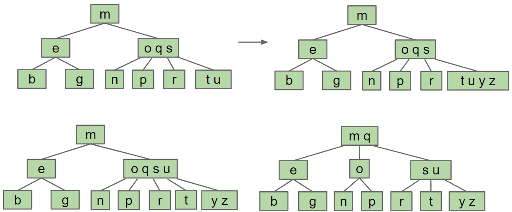

##### When The Root Get Too Juicy

| Juicy Root | Split Root |
|---|---|
| {>>Image<<}<image src="../assets/week8/juicy-root.png"> | {>>Image<<}<image src="../assets/week8/split-root.png"> |

#### Perfect Balance and Logarithmic Height

Observation: Splitting-tree has perfect balance
- If we split a leaf or an internal node, the height doesn't change
- If we split the root, every node gets pushed down exactly by one level

Punch Line: All operations have guaranteed $\Theta(log N)$ time
- $M$: Max number of *children* (1 + the item cap)
- Height $H$: *Between $\log_M (N)$ and $\log_2(N)$*
    * Every node has:
        + 2 children at least: $\log_2(N) \leq H$
        + $M$ children at most: $H \leq \log_M(N)$
- Max number of splitting operations per insert: $\sim{H}$
    * Time per insert/contains: $\Theta(H)$ or equivalently $\log (N)$

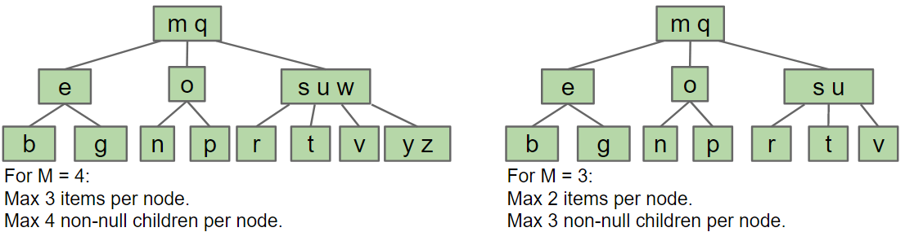

#### Name Convention

- A B-Tree of order $M = 4$ is also called a "2-3-4 Tree" or a "2-4 Tree"
- A B-Tree of order $M = 3$ is also called a "2-3 Tree"

B-Trees are most popular with very large $M$ (say thousands):
- Used in practical for databases and filesystems
- Since the small $M$ tree isn't practically useful, people usually only use the name "B-Tree" to refer to the very large $M$ case


## Red-Black Tree

### Motivation for Red-Black Tree

2-3 (or 2-3-4) Tree is a real pain to implement, and suffer from performance issues:
- Maintaining different node types
- Interconversion of nodes between 2-nodes and 3-nodes
- Walking up the tree to split nodes

> Beautiful algorithms are, unfortunately, not always the most useful.
> > Donald Knuth

Clever (and strange idea): *Build BST so that it is isometric (i.e. structurally identical) to a 2-3 tree*
- Use rotations to ensure the isometry
- Since 2-3 trees are balanced, rotations on BST will ensure balance

### Representing 2-3 Tree

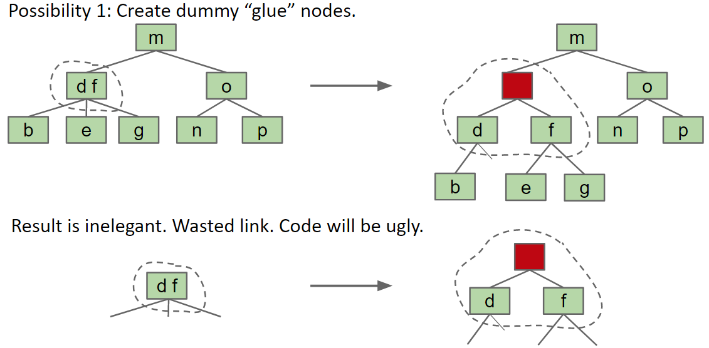

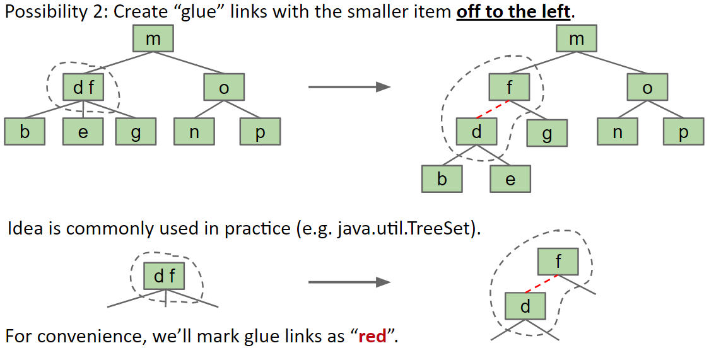

### Left-Leaning Red-Black Binary Search Tree (LLRB)

Any BST that maintains an isometry with a 2-3 Tree has these properties:
1. No node has two red links (otherwise it'd be like a 4 nodes)
2. Every path from root to a leaf has same number of black links: "Black balanced"
3. Red links lean left (just by convention)
4. Also called a "Left-Leaning Red-Black Binary Search Tree (LLRB)"

| 2-3 Tree | LLRB |
|---|---|
| {>>Image<<}<image src="../assets/week8/2-3-tree.png"> | <image src="../assets/week8/llrb.png">{>>Image<<} |

#### Interesting Facts {ignore=True .ignorenumbering}

For any 2-3 Tree (which is balanced), there exists a corresponding LLRB that has depth no more than 2 times the depth of the original 2-3 Tree
- Because of Rule.1 above

With a HUGE dose of cleverness can use rotations to maintain isometry after each insertion and deletion !


## Summary

2-3 and 2-3-4 Trees have perfect balance:
- Height is guaranteed logarithmic
- After insert/delete, at most 1 split operation per level of the tree
    * Since height is logarithmic, we have $O(\log N)$ splits
    * insert/delete are therefore $O(\log N)$
- But hard to implement

LLRB mimics 2-3 Tree behavior using tree rotation and color flipping
- Height is guaranteed logarithmic
- After insert/delete, at most 1 color flip or rotation per level of the tree
    * Since height is logarithmic, we have $O(\log N)$ flips/rotations
    * insert/delete operations are therefore $O(\log N)$
- Easier to implement, constant factor faster than 2-3 or 2-3-4 tree