---
html:
    embed_local_images: true
    toc: true
toc:
    depth_from: 1
    depth_to: 2
    ordered: false
export_on_save:
    html: true
---

<!-- Importing styles for numbering sections from H1 -->
<!-- @import "C:\Users\aviat\.atom\mpe-styles\numbering-from-h1.less" -->
<!-- Importing fancy github-light theme -->
<!-- @import "C:/Users/aviat/.atom/mpe-styles/fancy-github-light.less" -->


# Week 9 - Lec.23 & Lec.24 & Lec.25 {ignore=True .ignorenumbering}


## TOC {ignore=True .ignorenumbering}

<!-- @import "[TOC]" {cmd="toc" depthFrom=1 depthTo=2 orderedList=false} -->
<!-- code_chunk_output -->

* [Lec.23 - Hashing](#lec23-hashing)
	* [Hash Code](#hash-code)
	* [Handling Collision](#handling-collision)
	* [External Chaining](#external-chaining)
	* [Hash Table](#hash-table)
	* [Hash Function](#hash-function)
	* [Summary](#summary)
	* [Appendix - Open Addressing](#appendix-open-addressing)
* [Lec.24 - Priority Queues and Heaps](#lec24-priority-queues-and-heaps)
	* [`MinPQ`](#minpq)
	* [Heaps](#heaps)
	* [Heap Implementation](#heap-implementation)
	* [Heap Implementation of Priority Queue](#heap-implementation-of-priority-queue)
* [Data Structure Summary](#data-structure-summary)
* [Lec.25 - Advanced Trees](#lec25-advanced-trees)
	* [Tree Traversal](#tree-traversal)
	* [Depth First Traversal](#depth-first-traversal)
	* [Level Order Traversal](#level-order-traversal)
	* [Range Finding](#range-finding)
	* [Spatial (Geometric) Tree](#spatial-geometric-tree)
	* [Tree Iterator](#tree-iterator)

<!-- /code_chunk_output -->


# Lec.23 - Hashing

## Storing Data {ignore=True .ignorenumbering}

| Worst case runtimes | `contains(x)`    | `insert(x)`      |
|---------------------|------------------|------------------|
| Linked List         | $\Theta(N)$      | $\Theta(N)$      |
| Bushy BSTs          | $\Theta(\log N)$ | $\Theta(\log N)$ |
| Unordered Array     | $\Theta(N)$      | $\Theta(N)$      |

Bushy BST Limitations:
- Items must be comparable
- Maintaining bushiness is non-trivial
- We can do better than $\Theta(\log N)$ !

=> Hashing


## Hash Code

**Hash Code**: An index which is converted from an arbitrary number
- Java requires the EVERY object provide a method that converts itself into an integer: `hashCode()`


## Handling Collision

Biggest array in Java is 2 billion entries:
- Pigeonhole principle tells us that if there are more than 2 billion possible items, multiple items will share the same box
- => **Collision Handling**


## External Chaining

**External Chaining**: Storing collision items in a linked list
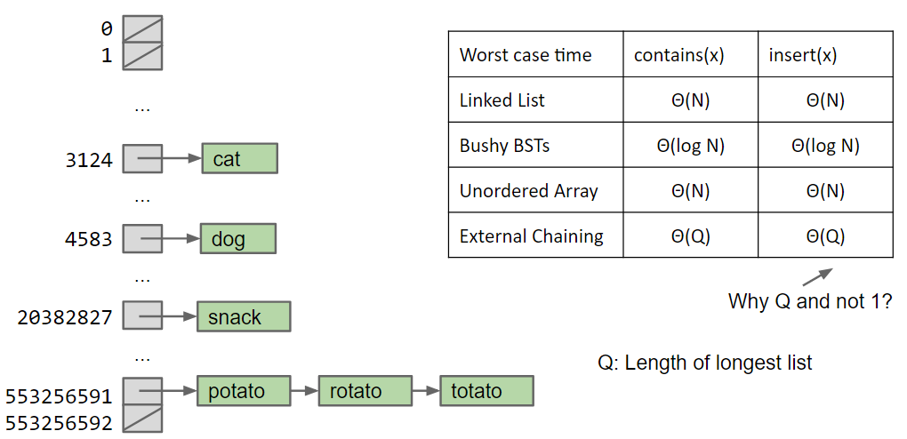

Observation: We don't actually need 2 billion buckets
- Can **{++use modulus++}** of hash code to reduce bucket count

### Performance {ignore=True .ignorenumbering}

Performance depends on the number of items in the bucket
- If $N$ items are distributed across $M$ buckets, average time grows with $N / M = L$, also known as ***load factor***
    * Average runtime: $\Theta(L)$

**Array Resizing**:
- Whenever load factor $L = N / M$ exceeds some number, *increase $M$ by resizing*
- Question: In which bin will the apple appear after resizing ?
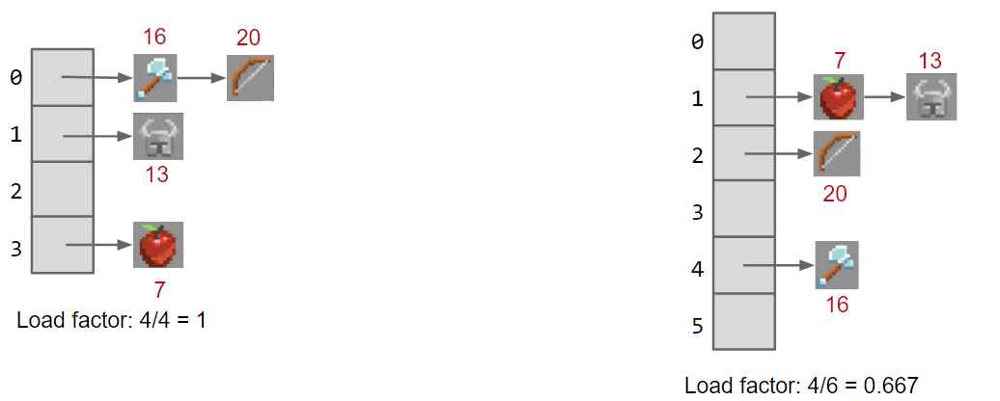


Assuming items are spread out (e.g.: not all in the same bucket):

| Average case runtimes            | `contains(x)`              | `insert(x)`                |
|----------------------------------|----------------------------|----------------------------|
| External Chaining, Fixed size    | $\Theta(L)$                | $\Theta(L)$                |
| External Chaining, with Resizing | $\Theta(L) \sim \Theta(1)$ | $\Theta(L) \sim \Theta(1)$ |
| Balanced BST                     | $\Theta(\log N)$           | $\Theta(\log N)$           |


## Hash Table

The data structure we've designed is called a ***hash table***:
- Every item is mapped to a bucket number using a hash function
- Typically, computing hash function consists of two steps:
    1. Computing a `hashCode` (integer between $-2^{31} $)
    2. Computing `index = hashCode modulo M`
        + Note: `%` for negative numbers won't work
- If `L = N / M` gets too large, increase `M`

If multiple items map to the same bucket, we have to resolve ambiguity somehow. Two common techniques:
- **External Chaining**: Creating a *list* for each bucket
- **Open Addressing**: Go to [Appendix](#appendix-open-addressing)


## Hash Function

- Hash code should spread things out nicely on real data:
    * e.g.1: Return 0 is a bad `hashCode` function
    * e.g.2: Converting string to integer of 32 base
        + Bad: Top bits are totally ignored
            - Because multiplying by 32 is equivalent to left shifting by 5 bits => Top characters get pushed out completely
        + => Multiplying by powers of 31 !

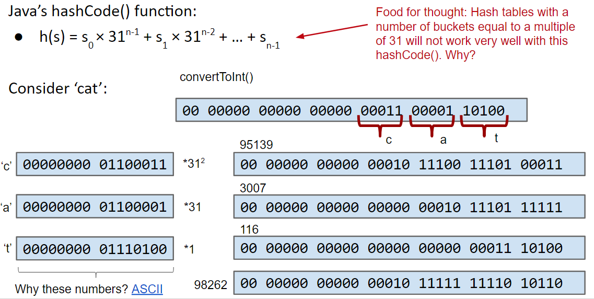

### Examples

#### List

```java
@Override
public int hashCode() {
    int hashCode = 1;
    for (Object o : this) {
        hashCode *= 31;  // elevate the current hash code
        hashCode += o.hashCode();  // add new item's hash code
    }
    return hashCode;
}
```

To save time hashing: Look at only first few items:
- Higher chance of collisions but things will still work

#### BST

```java
@Override
public int hashCode() {
    if (this.value == null) {
        return 0;
    }
    int hashCode = this.value.hashCode() + this.left.hashCode() * 31 + this.right.hashCode() * 31 * 31;
    return hashCode;
}
```

### Default `hashCode()` Method

All `Object`s have `hashCode` function:
- Default: Returns `this` (i.e.: address of object)
    * Can have strange consequences
        + E.g.: `"hello".hashCode() !== ("h" + "ello").hashCode()`
    * Can override for our type
    * Hash table (`HashSet`, `HashMap`, etc...) are so important that Java requires that all objects implement `hashCode()`


## Summary

With good `hashCode()` and resizing, operations are $\Theta(1)$ amortized:
- No need to maintain bushiness (but still need good `hashCode()`)
- *Store and retrieval doesn't require items to be comparable*

| Worst case runtimes    | `contains(x)`    | `insert(x)`      |
|------------------------|------------------|------------------|
| Linked List            | $\Theta(N)$      | $\Theta(N)$      |
| Bushy BSTs (`TreeSet`) | $\Theta(\log N)$ | $\Theta(\log N)$ |
| Unordered Array        | $\Theta(N)$      | $\Theta(N)$      |
| Hash Table (`HashSet`) | $\Theta(1)$      | $\Theta(1)$      |

## Appendix - Open Addressing {.ignorenumbering}

If target bucket is already occupied, use a different bucket:
- Linear probing: Use next address, and if already occupied, just keep scanning one by one
- Quadratic probing: Use next address, and if already occupied, try looking 4 ahead, then 9 ahead, then 16 ahead, and so on.


# Lec.24 - Priority Queues and Heaps


## `MinPQ`

We just want to save $M$ smallest items from all $N$ items only by using $\Theta(M)$ memory:

| Worst case runtimes | Ordered Array | Bushy BST        | Hash Table    | Heap             |
|---------------------|---------------|------------------|---------------|------------------|
| `add`               | $\Theta(N)$   | $\Theta(\log N)$ | $\Theta(1)$   | $\Theta(\log N)$ |
| `getSmallest`       | $\Theta(1)$   | $\Theta(\log N)$ | $\Theta(N)$   | $\Theta(1)$      |
| `removeSmallest`    | $\Theta(N)$   | $\Theta(\log N)$ | $\Theta(N)$   | $\Theta(\log N)$ |
| Caveats             | {>>nothing<<} | Dups not allowed | {>>nothing<<} | **Dups allowed** |


## Heaps

**Binary Min-Heap**: Binary tree that is ***complete*** and obeys ***min-heap property***:
- **Complete**: Missing items only at the bottom level (if any), all nodes are as far as possible
- **Min-Heap Property**: Every node is less than or equal to both of its children

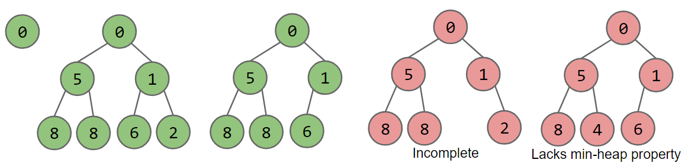


`MinPQ` operations given a heap: [Demo](https://docs.google.com/presentation/d/1VEd2Pm_3OuvkC1M8T5XAhsBTQFxVHs386L79hktkDRg/pub?start=false&loop=false&delayms=3000&slide=id.g11ecaeaf56_0_0)
- `getSmallest()`: Just return the item in the root node
- `add(x)`: Place `x` in the last position, and {++promote++} as high as possible
- `removeSmallest()`: Delete the root and place item at the last position at the root, then {++demote++} it repeatedly


## Heap Implementation

### Tree Representation 1

{++Create mapping from node to children++}: `BSTMap`'s approach

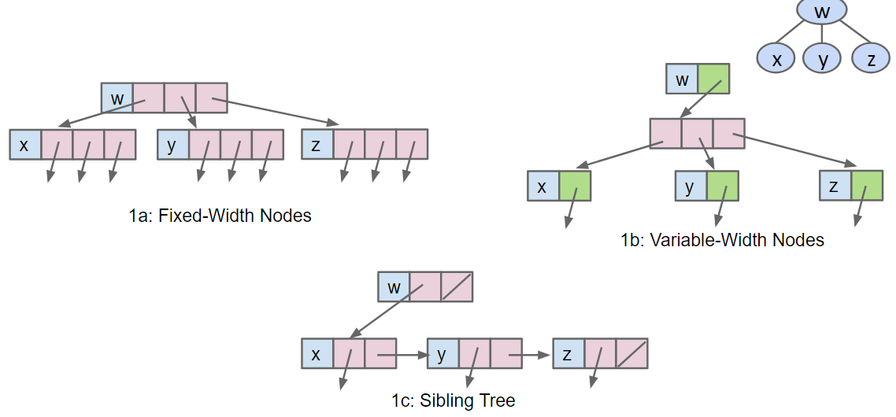

### Tree Representation 2

{++Store keys in an array, atst store parentIDs in a different array++}: Similar to `disjointSet`'s approach

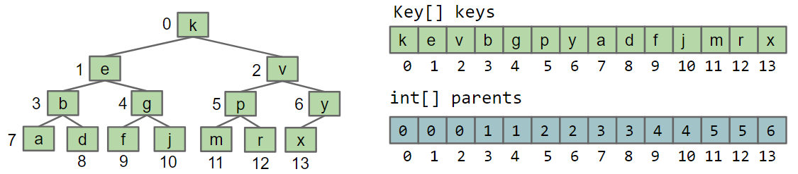

- If tree is complete, `parents` array is always like `[0, 0, 0, 1, 1, 1, ...]` => Tree representation 3

### Tree Representation 3

{++Store keys in an array, don't store structure anywhere++}:
- **Obviously only works for complete trees**

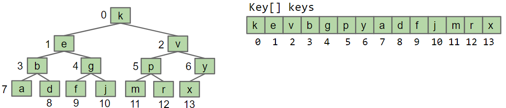

#### `promote` Method {ignore=True .ignorenumbering}

Let's write a method to *promote* a node to an appropriate position

```java
private void promote(int k) {
    int parentK = parent(k)
    if (keys[parentK] ≻ keys[k]) {
        swap(k, parentK);
        promote(parentK);
    }
}

private parent(int k) {
    return (k - 1) / 2; // Doesn't work for the root !!
}
```

`parent(int k)` method doesn't work for the root node ! => Tree representation 3b

#### Tree Representation 3b

Store keys in an array, {++offset everything by 1 spot++}:
- Makes computation of children / parents *nicer*
    * `parent(k)`: `k / 2`
    * `leftChild(k)`: `k * 2`
    * `rightChild(k)`: `k * 2 + 1`

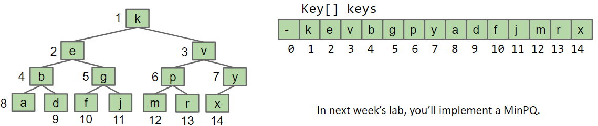

## Heap Implementation of Priority Queue

| Worst case runtimes | Ordered Array | Bushy BST        | Hash Table  | Heap             |
|---------------------|---------------|------------------|-------------|------------------|
| `add`               | $\Theta(N)$   | $\Theta(\log N)$ | $\Theta(1)$ | $\Theta(\log N)$ |
| `getSmallest`       | $\Theta(1)$   | $\Theta(\log N)$ | $\Theta(N)$ | $\Theta(1)$      |
| `removeSmallest`    | $\Theta(N)$   | $\Theta(\log N)$ | $\Theta(N)$ | $\Theta(\log N)$ |

Notes:
- Why "priority queue" ?: Can think of position in tree as its "priority"
- Heap is $\log N$ time AMORTIZED (with some resizing, but no big deal)
- BST can have constant `getSmallest()` if we keep a pointer to smallest
- Heaps handle duplicate priorities much more than BSTs
- Array based heaps take less memory: Very roughly about 1/3 the memory of representing a tree with approach 1a


# Data Structure Summary {.ignorenumbering}

| ADT           | Storage Operation(s)                 | Retrieval Operation         | Retrieve By:         |
|---------------|--------------------------------------|-----------------------------|----------------------|
| `List`        | `add(key)` <br> `insert(key, index)` | `get(index)`                | index                |
| `Set`         | `add(key)`                           | `containsKey(key)`          | key identity         |
| `Map`         | `put(key, value)`                    | `get(key)`                  | key identity         |
| `DisjointSet` | `connect(item1, item2)`              | `isConnected(item1, item2)` | two item values      |
| `MinPQ`       | `add(key)`                           | `getSmallest()`             | key order (key size) |

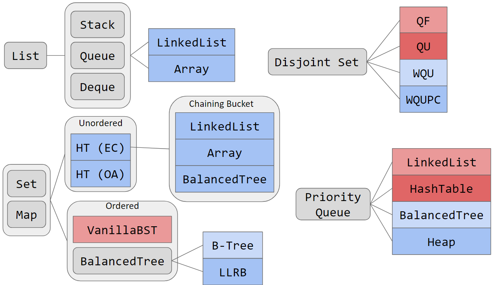


# Lec.25 - Advanced Trees


## Tree Traversal

"Traverse Tree": Visit every node in a tree:
- **Depth First Traversal**: Traverse *deep* nodes before *shallow* ones
    * Preorder, Inorder, Postorder
- **Level Order Traversal**: Traverse top-to-bottom, left-to-right


## Depth First Traversal

```java
preOrder(Tree tree) {
    if (tree == null) { return; }
    visit(tree.node);
    preOrder(tree.left);
    preOrder(tree.right);
}

inOrder(Tree tree) {
    if (tree == null) { return; }
    inOrder(tree.left);
    visit(tree.node);
    inOrder(tree.right);
}

postOrder(Tree tree) {
    if (tree == null) { return; }
    postOrder(tree.left);
    postOrder(tree.right);
    visit(tree.node);
}
```

- **Preorder**: Visit a node, traverse left child, then traverse right child
    * e.g.: `D B A C F E G`
- **Inorder**: Traverse left child, visit a node, then traverse right child
    * e.g.: `A B C D E F G`
- **Postorder**: Traverse left, traverse right, then visit a node
    * e.g.: `A C B E G F D`

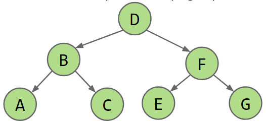

### Analysis Tip

We walk the graph, from top going counter-clockwise:
- Preorder traversal: Shout every time we pass the LEFT of a node
- Inorder traversal: Shout when we pass the BOTTOM of a node
- Postorder traversal: Shout when we pass the RIGHT of a node

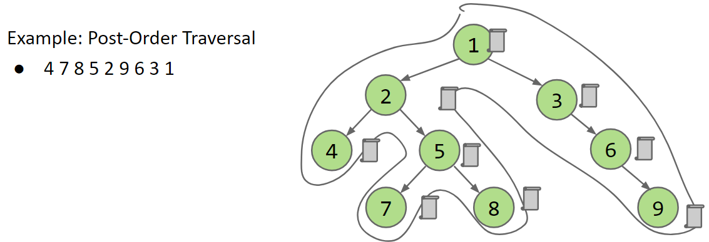

### Examples

- E.g.1: Printing directory listing: Preorder traversal:
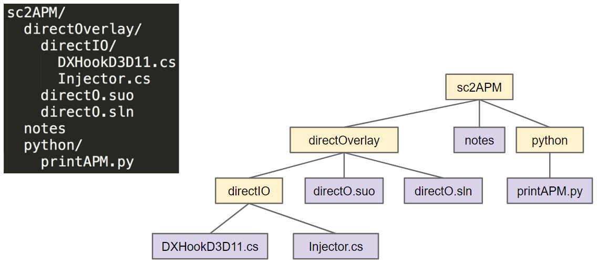

- E.g.2: Gathering file sizes: Postorder traversal:
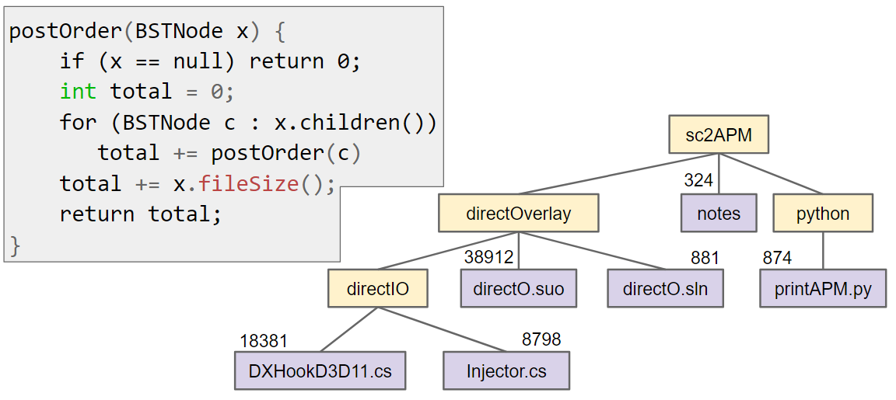

### Visitor Pattern

When writing general tree traversal code:
- Avoid rewriting traversal for every task of interest (e.g.: print, sum, file size, etc...)
- Use the Visitor pattern and Action interface

> Visitor pattern

```java
void preOrderTraverse(Tree<T> tree, Action<T> action) {
    if (tree == null) { return; }
    action.visit(tree.node);  // Don't hard code, e.g. `print`
    preOrderTraverse(tree.left, action);
    preOrderTraverse(tree.right, action);
}
```
i
> Action.java

```java
interface Action<T> {
    void visit(Tree<T> tree);
}
```

> FindPig.java

```java
class FindPig implements Action<T> {
    boolean found = false;
    
    @Override
    void visit(Tree<T> tree) {
        if ("pig".equals(tree.node)) {
            found = true;
        }
    }
}
```

> Main.java

```java
preOrderTraverse(tree, new FindPig());
```

### Runtime

The runtime of depth first traverse in terms of $N$, the number of nodes:
- **$\Theta(N)$: Every node visited exactly once, with constant work per visit**


## Level Order Traversal

### Iterative Deepening

- Visit nodes on 0th level, then 1st level, then 2nd level, and so on...
    * Run `visitLevel` $H$ times where $H$ is the height of tree

```java
public void levelOrder(Tree tree, Action action) {
    for (int i = 0; i < tree.height(); i += 1) {
        visitLevel(tree, i, action);
    }
}

private void visitLevel(Tree tree, int level, Action action) {
    if (tree == null) { return; }
    if (level == 0) { action.visit(tree.node); }
    else {
        visitLevel(tree.left, level - 1, action);
        visitLevel(tree.right, level - 1, action);
    }
}
```

### Runtime

> Runtime in terms of $N$, the number of nodes

| Tree                                                                 | Runtime           |
|----------------------------------------------------------------------|-------------------|
| **Complete tree** <br> 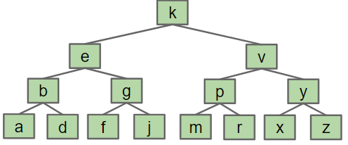 | **$\Theta(N)$**   |
| **Spindle tree** <br> 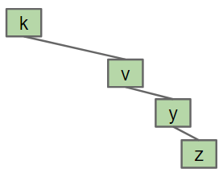   | **$\Theta(N^2)$** |

- Complete tree case:
    * Top level considered: $1$
    * Then top two levels considered: $1 + 2 = 3$
    * Then top three levels considered: $1 + 2 + 4 = 7$
    * Then top four levels considered: $1 + 2 + 4 + 8 = 15$
    * => Top $H$ levels: $2^1 + 2^2 + ... + 2^H - H = \Theta(2^H) = \Theta(N)$


## Range Finding

Suppose we want an operation that returns all items in a range:
- `public Set<K> findInRange(Tree tree, K min, K max)`

E.g.:
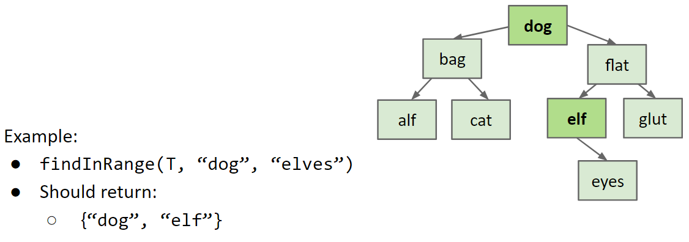

### Easy approach: {ignore=True .ignorenumbering}

- Just do a traversal of the whole tree, and use visitor pattern to collect matching items

```java
class RangeFind implements Action<T> {
    private T min, max;
    public Set<T> inRange;
    
    public rangeFind(T min, T max) {
        this.min = min;
        this.max = max;
        this.inRange = new HashSet<T>();
    }
    
    void action(Tree<T> tree) {
        if (tree.node ≼ max && tree.node ≽ min) {
            inRange.add(tree.node)
        }
    }
}
```

- Runtime is $\Theta(N)$

### Pruning {ignore=True .ignorenumbering}

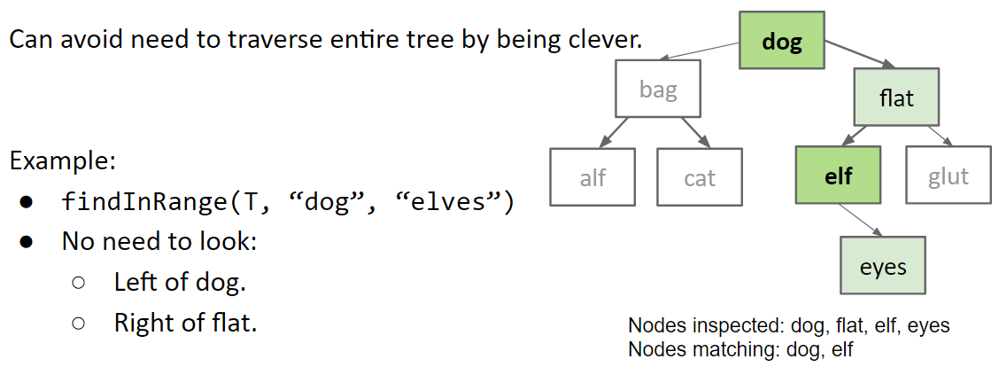

**Pruning**: Restricting our search only to nodes that might contain the answers we seek
- Runtime: $\Theta(\log N + R)$
    * $N$: Total number of nodes in tree
    * $R$: Number of matches


## Spatial (Geometric) Tree

### 2D Range Finding {ignore=True .ignorenumbering}

- E.g.: Query: How many objects are in the highlighted rectangle ?
    * 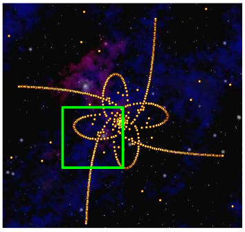
- Could iterate through all objects in $\Theta(N)$ time:
    * But we want to do some sort of tree + pruning

### Quadtree: Handling Multidimensional Data

Divide and conquer by splitting 2D space into four quadrants:
- Store items into appropriate quadrant
- Repeat recursively if more than one item in a quadrant

By definition, quadtree is either:
- Empty
- A *root* item at some position $(x, y)$ AND four quadtrees that are northwest, northeast, southwest and southeast of $(x, y)$
- Use TWO compares to decide which direction to go

#### Demo

Quadtree representation of 5 objects in 2D space: [Demo](https://docs.google.com/presentation/d/1vqAJkvUxSh-Eq4iIJZevjpY29nagNTjx-4N3HpDi0UQ/pub?start=false&loop=false&delayms=3000&slide=id.g11ecaeaf56_0_0):
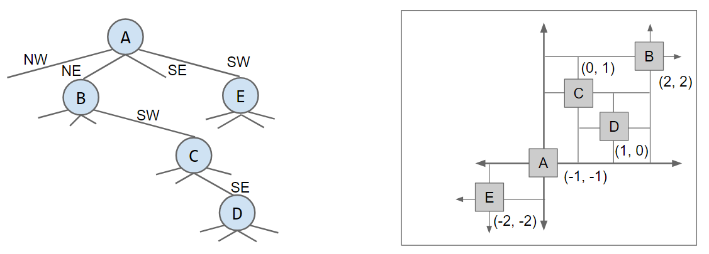

#### Pruning

Quadtree allows us to prune when performing a rectangle search:
- Prune a branch if the searched rectangle doesn't overlap a quadrant of potential interest

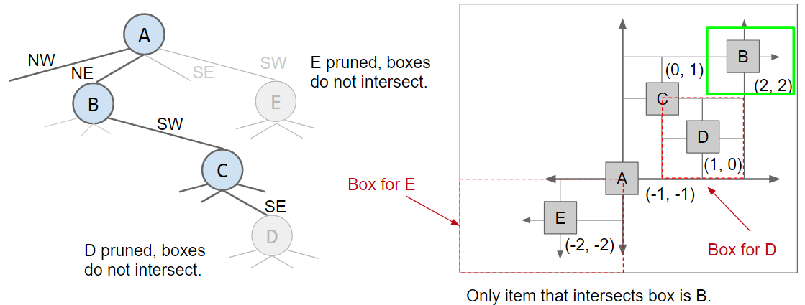


## Tree Iterator

### An Obvious Way

Create an class that implements `Action` interface and puts visited item in a list
- `iterator()` method creates such a list and returns an iterator to it

> ListBuilder.java
```java
public class ListBuilder<T> implements Action<T> {
    private List<T> list = new ArrayList<T>();

    public void visit(Tree<T> tree) {
        list.add(tree.node.key);
    }
}
```

> Tree.java
```java
import java.util.Iterator;


public class Tree<T> {

    private void preOrderTraverse(Action<T> action) {
        if (this != null) {
            action.visit(this);
            for (int i = 0; i < this.numChildren(); i += 1) {
                preOrderTraverse(this.child(i), action);
            }
        }
    }

    @Override
    public Iterator<T> iterator() {
        ListBuilder<T> lb = new ListBuilder<>();
        preOrderTraverse(lb);
        return lb.list.iterator();
    }

}
```

Downside: Memory usage

### Space-Saving Approach

Convert the recursive traversal above into iterative code using a stack.

```java
public class Tree<T> {
    
    private class preorderIterator implements Iterator<T> {
        Stack<Tree<T>> stack = new Stack<>();
        
        public preorderIterator() {
            s.push(Tree.this);  // `Tree.this is the parent tree`
        }
        
        public boolean hasNext() { return (!stack.isEmpty()); }
        
        public T next() {
            Tree<T> tree = s.pop();
            for (int i = 0; i < tree.numChildren(); i += 1) {
                s.push(tree.child(i));
            }
            return node.key;
        }
    }    
    
}
```